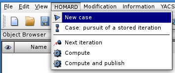
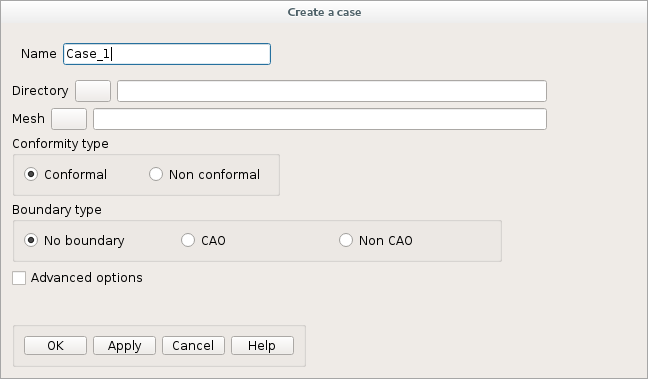
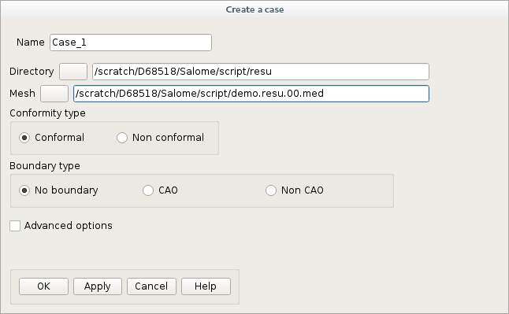
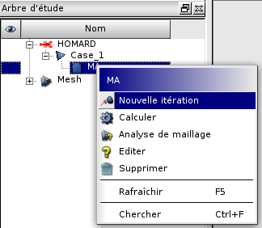
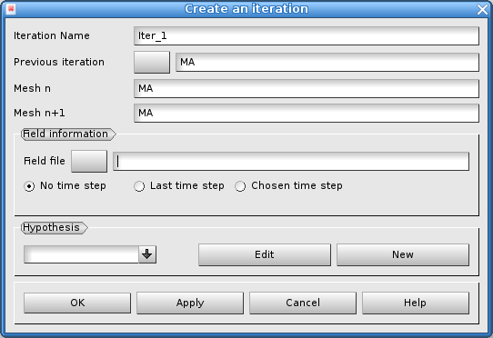
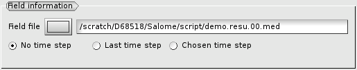
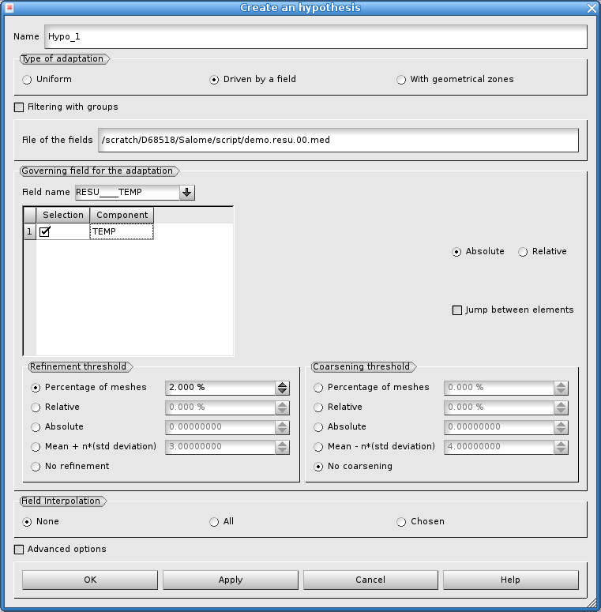
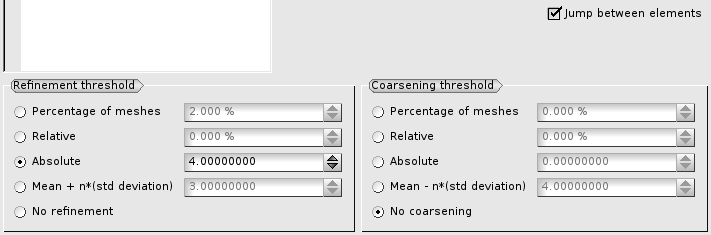
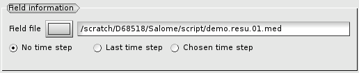

.. _demarrage_rapide:

Quick start
###########
.. index:: single: start
.. index:: single: example

The options to drive HOMARD in SALOME are described into :doc:`gui_usage`. Here are the basic instructions to discover how to use HOMARD from a very simple example.

Let's imagine that a calculation of a thermal problem has been done with a given mesh. An output MED file was produced; it contains the mesh and the field of the temperatures over the nodes. We'd like to adapt the mesh to decrease the variation of the temperature from one node to another below a threshold.

First, the module HOMARD is launched, by the creation of a new study; the same method as for the other modules of SALOME.

.. image:: images/homard_1.png
   :align: center

Once the activation of the module HOMARD is done, a case is created with the choice "*New case*" into the menu.

This window appears:

Two answers must be given: the directory that will contain the files produced by the further adaptations and the MED file from the initial calculation. In this case, the default options are left unchanged: conformity of the mesh and no curved boundaries. Validate by "Apply and close".

The object browser is enriched with this case. Unfold the case until the mesh of this iteration #0 can be seen. This iteration #0 is selected and a new iteration is required by "*New iteration*" into the menu or with the mouse.

This window appears:

The file that contains the field of temperature from the computation is selected. It is the same as the one given for the creation of the case.

Click "New" into the 'hypothesis' part. This window appears:

The default options are modified to respect our choice for the driving of the adaptation. Selecting the jump between elements and selecting an absolute threshold of 4.0 will produce the splitting of every single edge of an element where the variation of the temperature is higher than 4.0 between the two vertices of the edge.

The creation of the hypothesis is validated by "Apply and close"; the creation of the new iteration is validated too. The object browser is enriched by the description of this hypothesis and this iteration. The iteration can be seen with a specific icon "waiting".

The adaptation is launched by the selection of the iteration. "*Compute*" is choosen either in the menu, or with the mouse. The MED file of the new mesh, ``maill.01.med``, and some files for information are included into the object browser. Note that the MED file of the new mesh is located into the directory of the case.

.. image:: images/intro_37.png
   :align: center

Now, this new mesh can be used for a second thermal calculation, with the same conditions as for the first one. Once this second calcultion is done, the adaptive process can go on. First, go back into the module HOMARD of SALOME. The last iteration "*Iter_1*" is selected and a new iteration is asked for. This window appears:

The adaption goes on with the same criteria; the hypothesis "*Hypo_1*" is kept. The only operation is to give the name of the MED file from the last computation for the new field of temperature.

As before, the iteration is computed and the results are found into the directory of the case, including the mesh ``maill.02.med``.

.. image:: ../images/intro_40.png
   :align: center

A new calculation can be launched over this new mesh. The alternation computation/adaptation is done until the final result.
