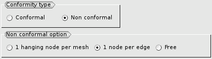
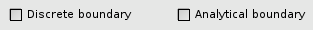
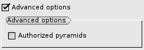
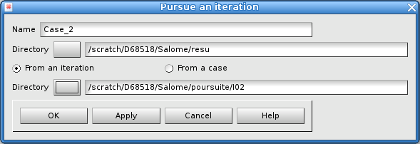
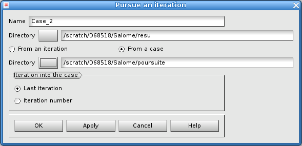
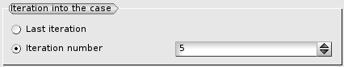

.. _gui_create_case:

The creation of a case
######################
.. index:: single: case

The definition of a case is done with the following data:

  - A name
  - A directory
  - The file of the initial mesh
  - The type of conformity for the serie of adaptations
  - Some curved boundaries

.. image:: images/create_case_1.png
   :align: center

Name of the case
****************
A name is automatically suggested for the case: Case_1, Case_2, etc. This name can be modified. It must be a new name.

The directory
*************
The directory will countain all the files producted by the successive adaptations. By default, nothing is suggested. The choice is made either by giving a name into the text zone or by a selection through the search window. In this directory, the MED files for the adapted mesh will be stored, with name ``maill.xx.med``, where ``xx`` is a rank number automatically created. These files can be seen into the object browser.

.. image:: images/create_case_2.png
   :align: center

.. index:: single: mesh;initial
.. index:: single: MED

The initial mesh
****************
The initial mesh must be stored into a MED file. Usually, it is produced by the software that solves the physical problem. But it also can be created by the module SMESH and exported with the MED format. The name of the file is choosen either by giving a name into the text zone or by a selection through the search window.

.. image:: images/create_case_3.png
   :align: center

.. note::
  Only one mesh into the file.

.. warning::
  The initial mesh must not be itself the product of an adaptation by HOMARD. If it is, the coherence between the different levels of refinement will be lost.

.. index:: single: conformity

Type of conformity
******************
The future iterations for this case must respect the the same behaviour regarding the type of conformity.

The default option, 'conformal', implies that the meshes produced by HOMARD will be conformal, as expected in the finite element method. This is a classical choice for most of the simulation software with the finite element method.

Nevertheless, if the computation is available with non conformal meshes, 3 possibilities are available:

* 1 node per element: an element must not have more than one hanging node with its neighbours.
* 1 node per edge: every single edge of an element ban be split once while its neighbour is not.
* free: no limit for the number of hanging node.

.. index:: single: boundary

The boundaries
**************
If the limit of the domain is curved, HOMARD can put the new nodes onto these curved limits to avoid some artificial singularities. This technique is effective for external limits as well for internal limits.

Two situations:

* 1D curve: this curve may be defined into a plane, for example for a 2D calculation. It can also be defined into the 3D space, for example to describe the intersection of two surfaces. Such a line is defined with a discrete desription.
* a surface: such a surface is defined with an analytical description.

Check the button:

The definition of the boundaries is described in :ref:`gui_create_boundary`.

.. index:: single: pyramid

Advanced options
****************
Par défaut, aucune option avancée n'est active.

Néanmoins, on peut définir une oprion avancée :

Par défaut, HOMARD sait traiter des maillages en 2 ou 3 dimensions et comportant les mailles suivantes :
   - mailles-points
   - segments
   - triangles
   - quadrangles
   - tétraèdres
   - hexaèdres
   - prismes

Si le maillage initial comporte des pyramides, il y a arrêt en erreur. Toutefois, si on est certain que les raffinements ultérieurs ne toucheront aucune des arêtes des pyramides, on cochera la case "Pyramides autorisées". Les adaptations se dérouleront normalement et les pyramides seront restituées telles quelles dans le maillage final.

The pursuit of a case
*********************
.. index:: single: pursuit
.. index:: single: yacs

La poursuite d'un cas correspond à la situation suivante :
Une série d'adaptations ont été conduites sur un cas puis SALOME est fermé. On a gardé les répertoires de travail de ces itérations. On souhaite ensuite reprendre ces itérations pour les poursuivre là où on s'est arrêté. Cette fonctionnalité est particulièrement utile dans le cas de schémas YACS pour lesquels on scinde en plusieurs parties une longue série d'adaptations.

La condition pour reprendre une itération est d'avoir conservé dans un même répertoire deux fichiers :
   - le fichier de configuration qui a servi de données au module exécutable de HOMARD ; ce fichier se présente sous la forme ``HOMARD.Configuration.(n).vers.(n+1)``
   - le fichier au format MED qui conserve l'historique des adaptations réalisées ; ce fichier se présente sous la forme ``maill.(n).hom.med``

On peut choisir de partir d'une itération archivée désignée explicitement par son répertoire ou d'une itération repérée dans le répertoire archivant un cas.

Pour poursuivre une itération connue par son répertoire d'archive, la définition du cas se fait par la donnée des informations suivantes :

  - Un nom
  - Un répertoire
  - Le répertoire qui contient les archives

On peut choisir de partir d'un cas déjà calculé ; par défaut, le nouveau cas sera créé en partant de la dernière itération précédemment calculée.

Si on souhaite partir d'une itération qui ne soit pas la dernière, il suffit de le préciser :

.. note::
  Les paramétrages du cas ainsi créé sont ceux de l'itération poursuivie : mode de conformité identique par exemple.

Object browser
**************
A l'issue de cette création de cas, l'arbre d'études a été enrichi de ce nouveau cas. On y trouve l'itération initiale, identifiée par le nom du maillage qui a été lu dans le fichier fourni.

.. image:: images/create_case_6.png
   :align: center

Corresponding python functions
******************************
Look :ref:`tui_create_case`

