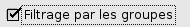
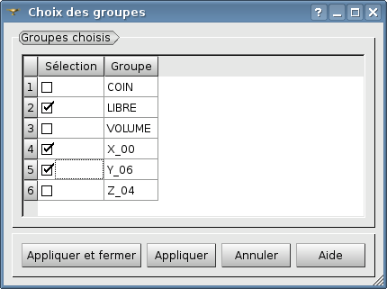
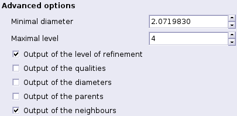

.. _gui_create_hypothese:

The hypothesis
##############
.. index:: single: hypothesis

The hypothesis contains all parameters of driving of a mesh adaptation. This operation allows to realize the iteration to which it is attached.

There are three classes of hypotheses:

  - Uniform over the whole mesh,
  - According to a field,
  - According to geometrical zone.

.. image:: images/create_hypothese_1.png
   :align: center

Name of the hypothesis
**********************
A name of the hypothesis is automatically proposed: Hypo_1, Hypo_2, etc. This name can be modified. It must not have been used for a previous hypothesis.

Uniform adaptation
******************
By default we propose a uniform refinement. When the starting point is a mesh which was already refined, the option of unrefinement will eliminate the produced elements.

Adaptation by a field
*********************

.. note::
  To be able to adapt the mesh according to a field it is beforehand necessary to have indicated the file med containing the field. It is made in the window of construction of the iteration (see :doc:`gui_create_iteration`). The name of the file which was selected is shown without possible modification here:

.. image:: images/create_hypothese_ch_1.png
   :align: center

The deliberate field is to be chosen in the list of fields contained in the file.
Once this field was chosen, the list of its components is displayed. It is enough to indicate the wished component(s).

If we choose a single component, by default, it is the absolute value which will be used, but it is possible to use the relative value. In the case of several components, by default HOMARD will use the L2 norm (Euclidian). We can however choose the infinite norm (the max of the absolute values of the components).

We can choose not to use directly the field, but its variation from an element to its neighbors. For that purpose, we shall check the button "*Jump between elements*".

.. image:: images/create_hypothese_ch_2.png
   :align: center

The refinement is made according to a threshold which defines a high criterion of refinement. All the elements for which the indicator is upper to this criterion will be refined.
For the choice of the criterion, four variants are possible:

  - According to a percentage of elements to be refined, real number included between 0 and 100; HOMARD will refine x% of the elements which have the biggest value of the field.
  - According to a relative value of the field, the number included between 0 and 100; HOMARD will refine the elements where the field is upper in x% of the interval [mini, maxi].
  - Beyond an absolute value; all the elements with a value of field superior to this value will be refined.
  - Beyond an absolute value that is equal to the average of the mean of the field increased of n times its standard deviation; all the elements with a value of field superior to this value will be refined.

The same convention applies to the unrefinement, the by replacing upper by lower. We can inactivate one of the functions (refinement or unrefinement) by checking the button ad_hoc.

.. image:: images/create_hypothese_ch_3.png
   :align: center

Adaptation by a zone
********************
.. index:: single: zone

In the starting up, it is necessary to create a first zone by activation of the button "*New*" (see :doc:`gui_create_zone`) :

.. image:: images/create_hypothese_zo_1.png
   :align: center

When zones were already created, the list appears in the window, what allows to select the deliberate zones. We then have to specify if a zone is used to refine all the elements a edge of which is contained in the zone, or if the zone is used for unrefine the internal elements in the zone. If no choice is made, the zone is ignored in this hypothesis.

.. image:: images/create_hypothese_zo_2.png
   :align: center

Filtering by the groups
***********************
.. index:: single: group

We can restrict the application of the hypothesis of adaptation to groups. So elements not belonging to these groups will not be modified, except by later contamination of the refinement to assure the conformity of the final mesh.
We check the associated button:

The list of the present groups of elements in the mesh is shown. It is enough to check those wanted to restrict the hypothesis of adaptation.

Interpolation of fields
***********************
.. index:: single: interpolation

.. note::
  To be able to interpolate a field from the former towards the new mesh, it is beforehand necessary to have indicated the file med containing the field. It is made in the window of construction of the iteration (see :doc:`gui_create_iteration`).

By default, no field is interpolated. On the contrary, we can ask for the interpolation of all the present fields in the supplied file:

.. image:: images/create_hypothese_ch_4.png
   :align: center

If we want to choose fields to be interpolated, it is necessary to check them in the list of all the present fields in the supplied file:

.. image:: images/create_hypothese_ch_5.png
   :align: center

Advanced options
****************
If the compartment "*Advanced Options*" is not checked, no additional constraint is defined.
If the compartment is checked, we shall define the advanced options.

A first series of options concern the maximal sharpness of mesh which we do not want to exceed. Two directives are possible, separately or together. We can impose a size of minimal element: a element the diameter of which is lower than this limit will not be any more split. By default, we propose a minimal 0 diameter, what means imposing nothing. We can impose a level of maximal refinement. By default, the maximum is 99, what amounts generally to impose nothing.

The second series of options has interest only in case the adaptation is driven by a field and in case this field is not defined everywhere in the mesh. It arrives for example when we build a field based on a distance in a plan while the domain is 3D: the field will not be defined on nodes outside the plan. For such fields, this option allows to specify the behavior which we wish in the regions where the field is not defined. By default, there is nothing: elements are kept as they are. We can choose two other variants: to refine all the elements will a priori be cut, or to unrefine all the elements will be candidate in the unrefinement.

The last choice concerns an additional output of the adaptation. By default, nothing is checked and no field is produced. If at least one compartment is checked, the output file MED will contain some extra fields. The first choice represents the level of refinement of every element. The convention is the one of HOMARD: an element of the initial mesh is of level 0, an element produced by the refinement of an initial element carries the level 1, etc. The elements of transition which are produced between two different levels, n and n+1, are affected by the half-level n+0,5. The second choice is for the quality of the elements. The third choice is for the diameters of the elements.

Object browser
**************
.. index:: single: object browser

The object browser contains the created hypotheses and the iterations which use them. The description of the zones which are possibly attached to them is present.

.. image:: images/create_hypothese_2.png
   :align: center

Corresponding python functions
******************************
Look :doc:`tui_create_hypothese`
