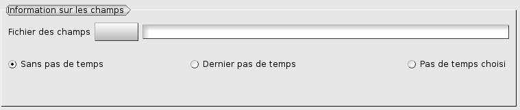

.. _gui_create_iteration:

The iteration
#############
.. index:: single: iteration

The definition of an iteration is done by the following information:

  - The previous iteration
  - The name of the resulting mesh
  - The used hypothesis
  - Possibly, the file of the field of error indicators

.. image:: images/create_iteration_1.png
   :align: center

Name of the iteration
*********************
A name of iteration is proposed automatically: Iter_1, Iter_2, etc This name can be modified. It must not have been used for a preceding iteration.

The preceding iteration
***********************
The preceding iteration is selected in the object browser. The name of the corresponding mesh will be posted.

.. index:: single: mesh;result

The name of the resulting mesh
******************************
The current iteration will produce a mesh. This mesh will be known under a name. This name is provided by typing it in the zone of text. By default, one proposes a name identical to that of the preceding iteration.

.. index:: single: field
.. index:: single: MED

The field
*********
To create or use an hypothesis of adaptation based on a field expressed on the mesh, one must provide the file where the field is. It is also the case if one wants to interpolate fields from mesh #N to the mesh #(N+1). This file is with format MED. Classically, it will have been produced by the computation software with which one works. The name of the file can be provided, either by typing the name in the zone of text, or by activating the function of research.

If steps of time were defined, a simple solution consists in treating the fields with the last step of time recorded in the file. If one wants to define another step of time, one notches the button "*Given time step*". The values of 'time' and 'Sequence number' are those corresponding to convention MED (time step/rank). These values depend on the logic which was retained by the software which wrote the file. Often these two values are identical but it happens that one disjoins the time steps and the intervals of saving.

.. image:: images/create_iteration_3.png
   :align: center

.. index:: single: hypothesis

The hypothesis
**************
The iteration in progress will control the adaptation by HOMARD according to a scenario defined on an hypothesis. This one is selected in the list of the existing hypotheses.

With starting, it is necessary to create a first hypothesis by activation of the button "*New*" (see: :doc:`gui_create_hypothese`) :

.. image:: images/create_iteration_4.png
   :align: center

Then, if an hypothesis previously defined is appropriate, it is enough to select it in the proposed list. If not, it is necessary to create a new hypothesis by activation of the button "*New*", then to select it in the proposed list:

.. image:: images/create_iteration_5.png
   :align: center

.. note::
  If one considers an adaptation according to the values of a field on the mesh, it is necessary to have given information about this field before creating a new hypothesis.

.. index:: single: object browser

Object browser
**************
At the conclusion of this creation of iteration, the object browser was enriched. One finds there the initial iteration, identified by the name of the mesh which was read in the provided file, the current iteration, identified by its name. One finds also the hypothesis which is attached to him. The icon compared to the iteration makes it possible to differentiate the iterations calculated or not.

.. image:: images/create_iteration_6.png
   :align: center

When several iterations are connected, their hypothesis is visible in the object browser. One will notice in the figure hereafter that two iterations can share the same hypothesis.

.. image:: images/create_iteration_7.png
   :align: center

Corresponding python functions
******************************
Look :doc:`tui_create_iteration`
