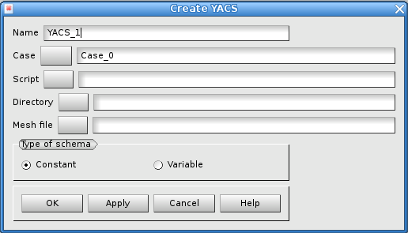

.. _gui_create_yacs:

The schema YACS
###############
.. index:: single: YACS
.. index:: single: case

The object YACS contains every definition that allows the creation of a schema. This schema will drive the alternation of the computation of a physical modelization over a mesh and the adaptation of the mesh for the computation. This alternation is driven by some criteria for the convergence.

.. note::
  To read an exhaustive description of any part of the schema, see :ref:`yacs`

Procedure
*********
The automatic creation of the schema is going to be made in three phases.

- At first, it is necessary to have done a calculation on the very first mesh. This calculation will have produced the results in a MED file.
- Then, a case is created in the module HOMARD, as described in :ref:`gui_create_case`. In this case, we create the following iteration of the mesh by defining a hypothesis of adaptation ; see :ref:`gui_create_iteration`.
- Last, from this case, a schema will be created, based on the hypothesis for the adaptation.

Name of the schema
******************
A name of schema is automatically proposed: YACS_1, YACS_2, etc. This name can be modified. He must not have been already used for another schema.

The script
**********

The file containing the script which allows to launch the calculation connected to the physical modelling is supplied here. It is a script python who has to respect the following rules:

- the name of the class which manages the calculation is ``Script``
- to launch the calculation is made by the method``Compute()``
- the result of the calculation is under the shape of three variables: the code of error, a message, a dictionary python.

If they are necessary for the creation of the class, we can supply arguments under the shape:

- ``--rep_calc=rep_calc``, where ``rep_calc`` is the directory for the computation
- ``--num=num``, where ``num`` eis the number of calculation : 0 for the very first calculation, then 1, 2 etc.
- ``--mesh_file=meshfile``, where ``meshfile`` is the file that contains the mesh for the computation
- ``-v``, for the messages

In return:

- ``error`` : the error code, integer: 0 if it was correct, non 0 if not
- ``message`` : a possible message of information about the calculation
- ``dico_resu`` : a dictionary python that contains at less the two following keys: ``FileName`` is the key for the name of the MED file which contains the results of the calculation, ``V_TEST`` is the key for the real value to be tested.

Example for the script:
::

    argu = ["--rep_calc=" + rep_calc)]
    argu.append("--num=%d" % numCalc)
    argu.append("--mesh_file="  + MeshFile)
    Script_A = Script(argu)
    error, message, dico_resu = Script_A.compute ()

.. note::

  * To drive Code_Aster : :download:`ScriptAster<../files/yacs_script.py>`

The directory
*************
The directory will countain all the files producted by the computations. By default, nothing is suggested. The choice is made either by giving a name into the text zone or by a selection through the search window.

The initial mesh
****************
The initial mesh must be stored into a MED file. It is the very first mesh that is used to solve the physical problem. The name of the file is choosen either by giving a name into the text zone or by a selection through the search window.

The type of the schema
**********************
Two types of schemas are proposed: constant or variable.

The default choice, 'constant', alternate a computation that is always the same and a mesh adaptation: from a computation to another one, the only part that is changed is the mesh. All the rest is identical. For example, in case the calculation would model a transient phenomenon, it is always the completeness of the transient phenomenon that is taken into account.

The option 'variable' is inactive today.

Corresponding python functions
******************************
Look :ref:`tui_create_yacs`

