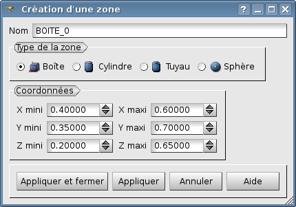
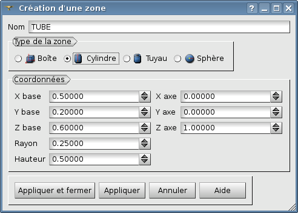
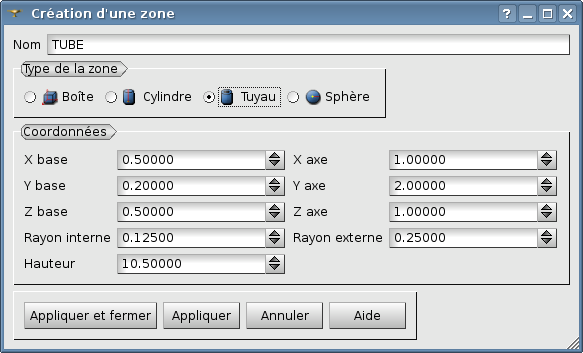

.. _gui_create_zone:

The zone
########
.. index:: single: zone
.. index:: single: 2D

The object zone contains all the geometrical definitions allowing to describe a zone to be refined.

In 3D, there are four types of zone:

  - Box
  - Cylinder
  - Pipe
  - Sphere

Their analogues in 2D are:

  - Rectangle
  - Disk
  - Disk with a hole

The principle of the refinement according to zones is the following one. Every edge of element among which both extremities are included in the same zone will be cut. Then HOMARD applies the algorithm of processing of it conformity to produce a correct mesh.

.. note::
  The values proposed by default for the size of zones take into account the geometry of the mesh.

Name of the zone
****************
A name of zone is automatically proposed: Zone_1, Zone_2, etc. This name can be modified. He must not have been already used for another zone.

Box
***
.. index:: single: box

The parallelepiped is necessarily parallel to coordinate system. It is defined by its extremes in every direction.

Cylinder
********
.. index:: single: cylindre

The cylinder is defined by its axis, a basis point positioned on the axis, its height and its radius. The axis is defined by a vector which must be correctly directed: we shall retain the ready volume of the basis in the direction of the vector until the reserved height. The norm of this vector is not inevitably equal to 1.

Pipe
****
.. index:: single: pipe

The pipe is defined by its axis, a basis point positioned on the axis, its height and its internal and external radius. The axis is defined by a vector which must be correctly directed: we shall retain the ready volume of the basis in the direction of the vector until the reserved height. The norm of this vector is not inevitably equal to 1.

Sphere
******
.. index:: single: sphere

The sphere is defined by its center and its radius.

.. image:: images/create_zone_4.png
   :align: center

Rectangle
*********
.. index:: single: rectangle

The rectangle is necessarily parallel to coordinate system. It is defined by its extremes in each of the valid directions. The constant coordinate is shown for information, but is not modifiable.

.. image:: images/create_zone_21.png
   :align: center

Disk
****
.. index:: single: disk

The disk is necessarily in the plan of coordinate system. It is defined by its center and its radius. The constant coordinate is shown for information, but is not modifiable.

.. image:: images/create_zone_22.png
   :align: center

Disk with a hole
****************
.. index:: single: disk with a hole

The disk with hole is necessarily in the plan of coordinate system. It is defined by its center and its external and internal radius. The constant coordinate is shown for information, but is not modifiable.

.. image:: images/create_zone_23.png
   :align: center

Corresponding python functions
******************************
Look :doc:`tui_create_zone`
