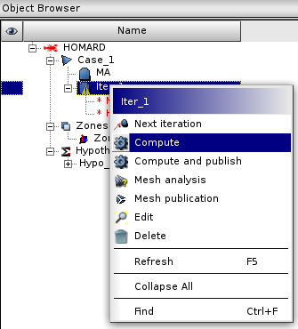
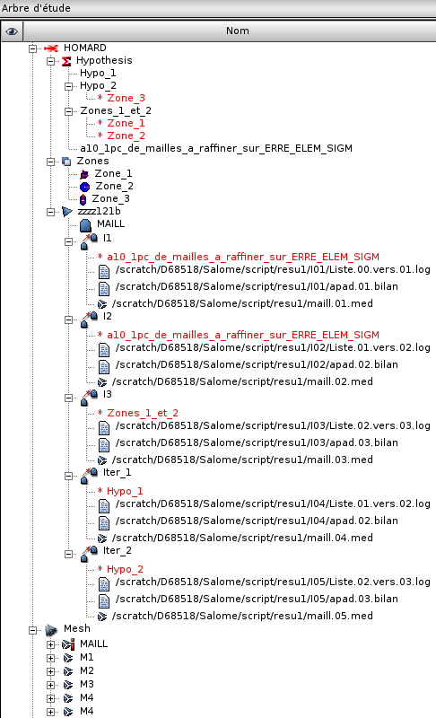

.. _gui_homard:

The computation
###############
.. index:: single: iteration
.. index:: single: computation
.. index:: single: SMESH

To compute an iteration
***********************
To launch an adaptation obtains by selecting the iteration to calculate. It is identified by an icone "wait". We choose then "*Compute*" or "*Compute and publish*" in the menu HOMARD or with the mouse. In the first case, the adaptation is done and the MED files are written down. In the second case, the new mesh will be published into SMESH. Note that if the choice "*Compute*" was used, the new mesh can be published afterwards, using the choice "*Publish*".

.. index:: single: object browser

Object browser
**************

At the end of this calculation, the object browser was enriched. The icone in front of the iteration is validated. Under the iteration, we find the reference to the files of results created, identified by their name in the directory *rep* which was defined in the creation of the case:

  - *rep*/I(n+1)/Liste.n.vers.(n+1).log
  - *rep*/I(n+1)/apad.n.vers.(n+1).bilan
  - *rep*/maill.(n+1).med

The first two files are text files, editable. Liste.n.vers.(n+1).log contains information on the progress of the adaptation: summary of the mode of adaptation, percentage of concerned elements, etc. The file apad.n.vers.(n+1).bilan is a summary of the characteristics of the obtained mesh.

The file maill.(n+1).med is the one which contains the mesh produced in the format MED. If the publication was selected, we find this mesh in the section of the object browser of the module SMESH. It is then visible in this module and usable then as quite different mesh.

To consult the result of an adaptation
**************************************
Both text files, Liste.n.vers.(n+1).log and apad.n.vers.(n+1).bilan, are visible by selecting them. We choose then "*Edit file*" in the menu HOMARD or with the mouse.

.. image:: images/lancement_3.png
   :align: center

.. note::
  By default, the calculation is launched with the load module of HOMARD installed with SALOME. If we wish to use a personal version of HOMARD, to test an evolution for example, it is necessary to specify where the new load module is available. For that purpose, it is necessary to have got two variables of environment.
  "*HOMARD_REP_EXE_PRIVATE*" defines the directory in which is the load module
  "*HOMARD_EXE_PRIVATE*" defines the name of the load module in this directory, if this name is different of "*homard*".

Corresponding python functions
******************************
Look :doc:`tui_create_iteration`

