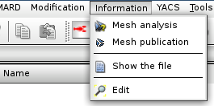
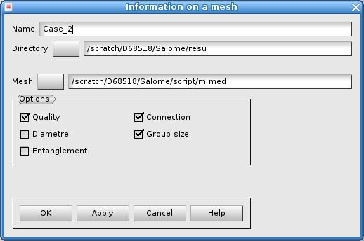
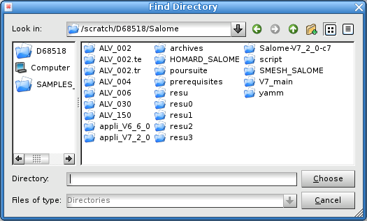
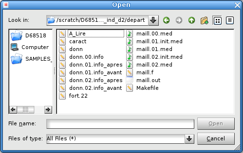
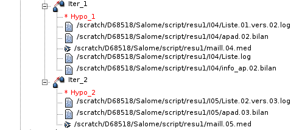

.. _gui_mesh_info:

Mesh analysis
#############
.. index:: single: analysis
.. index:: single: information

The request of analysis of a mesh is made by the following information:

  - A directory
  - A mesh file

If the mesh is a part of a registered case, its analysis is made from its iteration in the object browser. See farther.

Importation of the mesh
***********************
The selection of the function of analysis is made by the menu of the superior bar of the window:

The window of choice is displayed.

Name of the case
****************
A name of case is automatically proposed: Case_1, Case_2, etc. This name can be modified. He must not already have been used for another case.

The directory
*************
The directory is the one which will contain files produced by the information. By default, nothing is proposed. The choice is made, either by typing the name in the text field, or by activating the function of research. It is in this directory that will be exported the files of information of name "Liste.log" and "info_av.00.bilan". These files will be visible in the object browser.

.. index:: single: mesh;initial
.. index:: single: MED

Mesh to be analysed
*******************
The mesh to be analyzed has to be in a file in the format MED. The name of the file can be supplied, either by typing the name in the text field, or by activating the function of research.

.. note::
  The file has to contain only a single mesh.

.. warning::
  The mesh does not have to be produced of an adaptation of mesh by HOMARD itself, at the risk of losing the analysis of the various levels of refinement / unrefinement

Options for the analysis
************************
The analysis is made according to the marked options.
  - Quality of elements
  - Diameter of elements
  - Connectivity of the domain; in a single piece, how many holes, etc.
  - Sizes of the constituents of the domain, group by group
  - Interpenetration of elements, by dimension

The result of the analysis is contained in the file "info_av.00.bilan"; this file is to be consulted by showing it after its name with "*Edit file*" in the menu HOMARD or with the mouse.

Object browser
**************
At the end of this request of information, the object browser was enriched by this new case. We find the initial iteration there, identified by the name of the mesh which was read in the supplied file, and both files of information of name "Liste.log" and "info_av.00.bilan".

.. image:: images/mesh_info_3.png
   :align: center

Computed iteration
******************

To analyze the mesh produced by an iteration of mesh adaptation, we indicate with the mouse this iteration in the object browser and we launch the analysis. We find the menu similar to the initial case:

.. image:: images/mesh_info_4.png
   :align: center

As for an imported mesh, the object browser was enriched with both files of information of name "Liste.log" and "info_ap.xx.bilan", where xx is the number of the iteration in the case.

Corresponding python functions
******************************
Look :doc:`tui_create_case` and :doc:`tui_create_iteration`

