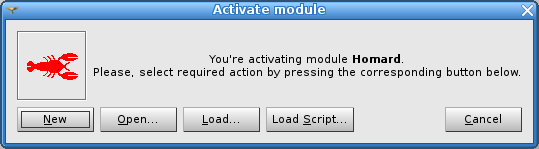

.. _gui_usage:

User's guide of the graphical interface
#######################################
.. index:: single: case
.. index:: single: iteration

Activation of the module HOMARD
*******************************
Two ways can be used to launch the module HOMARD:

#. by activating the tab HOMARD into the list of the modules
#. by clicking the button HOMARD into tool bar

The user can choose either to start a new study or to open an old stored one, as it can be done for every module of SALOME.

Definition of an adaptation
***************************

Once the activation of the module HOMARD is done, a case is created. The initial mesh of the series of adapted meshes is selected (see :doc:`gui_create_case`). From this case, the successive iterations are defined (see :doc:`gui_create_iteration`) with hypotheses (see :doc:`gui_create_hypothese`). The adaptations are launched as described in :doc:`gui_homard`.

User's guide of the graphical interface
***************************************

.. toctree::
   :maxdepth: 2

   gui_create_case
   gui_create_iteration
   gui_create_hypothese
   gui_create_zone
   gui_create_boundary
   gui_homard
   gui_mesh_info

Creation of a schema YACS
*************************

An automatic creation of a schema YACS is available in the module HOMARD.

.. toctree::
   :maxdepth: 2

   gui_create_yacs
   gui_create_yacs_aster

Preferences
***********

Some default options for the module HOMARD are defined into the preferences.

.. toctree::
   :maxdepth: 2

   preferences
