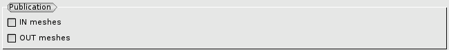

.. _preferences:

The preferences
###############
.. index:: single: preferences

Some default options for the module HOMARD are defined into the preferences.

The language
************
The language that is selected into the general preferences of SALOME is used for the menus of the GUI.

If french is selected, the messages that are produced by HOMARD are in french. Otherwise, english is used.

Publication of the meshes
*************************
.. index:: single: publication

By default, the meshes that are read during the creation of the case or that are produced after an adaptation are not published into SMESH. This choice can be modified here.

