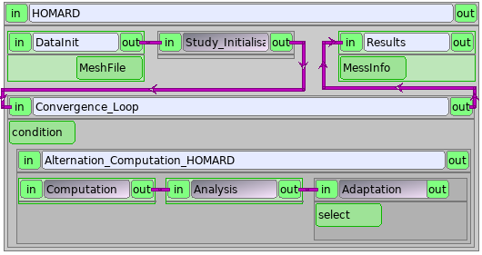
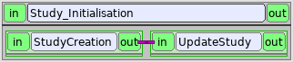
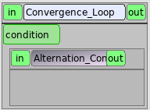
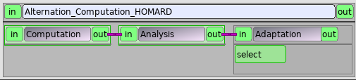
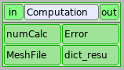
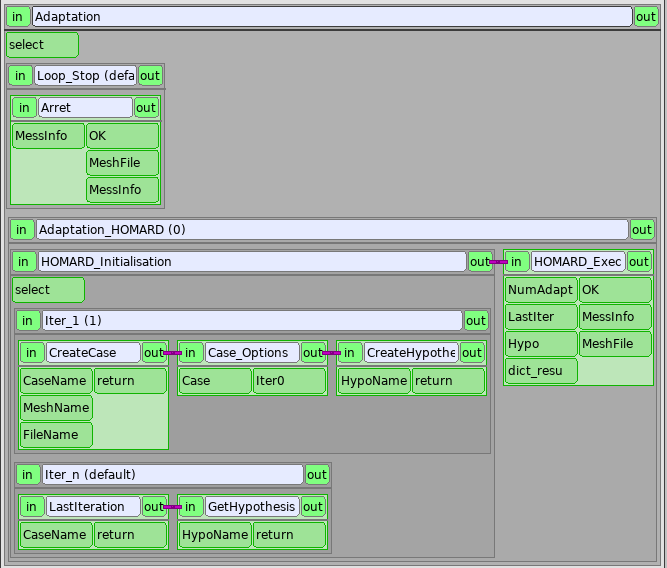
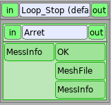
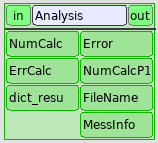

.. _yacs:

YACS
####
.. index:: single: YACS

Using a YACS scheme allows the coupling between a computation and an adaptation as described into :doc:`intro`. This coupling can be repeated inside a loop as long as a criteria for the convergence is reached for instance. Many ways are available to program a YACS scheme. The solution that is shown here is correct but many others are too!

In this part, an extensive description of a schema YACS is available.

.. note::
  The module HOMARD proposes an automatic creation of a schema YASC starting from a defined case. To do that, see :doc:`gui_create_yacs`

Introduction
************

Here is the description of a scheme for a computation in which a value is to be stabilized. The computation starts over an initial mesh, then HOMARD makes an adaptation. A new computation is done over this new mesh and its result is analyzed. Depending on this analysis, the coupling goes on or does not. The general look of the scheme is this one:

.. note::
  Among all the treated data, certain are unchanging: the name of the directory of calculation, the name of the case, the name of the hypothesis of adaptation, etc. It was chosen to impose them 'hard' in the various parameters of service or within the scripts python. We could also define them a priori in a node PresetNode and then pass on them by links. We did not hold this solution because it increases strongly the number of parameters and links attached to every node. It is very penalizing for the legibility of the scheme. The only data which are going to circulate are the ones been imperative by the description of the service and those that evolve during the execution of the scheme.

The boxes
*********

The main boxes are:

- DataInit : initialisation of the initial mesh
- Study_Initialisation : launching of the module HOMARD inside SALOME
- Convergence_Loop : gestion of the loop computation/adaptation
- Results : final information

DataInit
========
.. image:: ./images/yacs_a_01.png
   :align: center
   :alt: DataInit
   :width: 158
   :height: 61

This box is type PresetNode's elementary node. Its only function is to initialize the variable MeshFile that contains the name of the file of the initial mesh.

.. literalinclude:: ../files/yacs_01.en.xml
   :lines: 37-41

Study_Initialisation
====================
The box Study_Initialisation launches the component HOMARD inside SALOME. It is a block consisted of two parts, that are invariable whatever is the envisaged application:

- StudyCreation : python node
- UpdateStudy : service of the component HOMARD

The python node StudyCreation initialize the SALOME study that is given through the output:

.. literalinclude:: ../files/yacs_01.en.xml
   :lines: 43-59

The service UpdateStudy connects this study to an instance of HOMARD.

.. literalinclude:: ../files/yacs_01.en.xml
   :lines: 60-64

Convergence_Loop
=====================
The box Convergence_Loop is type WhileLoop. The condition is initialized with 1: the internal block Alternation_Computation_HOMARD is executed. Within this block, we calculate and we adapt the mesh; when the process has to stop either as a result of error, or by convergence, the condition passes to 0. The loop ends and we pass in the following box, Results.

Results
=======
.. image:: ./images/yacs_d_01.png
   :align: center
   :alt: Results
   :width: 157
   :height: 62

This box is a node python that takes in input a character string, MessInfo. If everything passed well, this message is empty. A window QT appears to confirm the convergence. If there was a problem, the message contains messages emitted during the calculations. The window QT shows this message.

.. literalinclude:: ../files/yacs_01.en.xml
   :lines: 398-411

Loop for the calculations
*************************

This box is a block that manages the computation, the adaptation and the analysis.

Computation
===========

This box is a node python that is going to drive the calculation. In input, we find the number of the calculation (0 at first) and the name of the file which contains the mesh on which to calculate. In output, we find an integer which represents the error on this calculation (0 so everything goes well) and a dictionary python gathering the results of the calculation. The body of the node is established by the launch of a script python that activates the calculation.

.. literalinclude:: ../files/yacs_01.en.xml
   :lines: 70-90

In this example, we must define:

- rep_calc : the directory in which will be executed the calculation.
- rep_script : the directory in which is the python that will launch the calculation. This directory is to be added to the PATH. From this directory, we shall import Script from the file ScriptAster.py

The python Script is programmed as the user wishes it so that the calculation can be made on the current mesh. According to the mode of launch of the code of calculation, we can need other information, as the number of the calculation or the directory of the calculation for example. The freedom is total. In our case, the arguments of input are the name of the file of mesh, the number of the calculation and the directory of calculation. They are given in a list python: ["--rep_calc=rep_calc", "--num=numCalc", "--mesh_file=MeshFile"]
].

On the other hand the output of the script has to obey the following rule. We get back a code of error, an error message and a dictionary. This dictionary contains necessarily the following keys:

- "FileName" : the name of the file that contains the results of the calculation
- "V_TEST" : the value the convergence of which we want to test

Adaptation
==========

The box Adaptation is a Switch node driven by the code of error of the previous calculation. If this code is nil, YACS will activate the box Adaptation_HOMARD that will launch the adaptation. If the code is not nil, we pass directly in the box Loop_Stop.

Adaptation_HOMARD
-----------------
The first task tries to execute concern the initialization of the data necessary for HOMARD in the box HOMARD_Initialisation. This box is a switch node driven by the number of the calculation. In the starting up, the number is nil and YACS activates the box Iter_1.

Iter_1
^^^^^^
.. image:: ./images/yacs_c_06.png
   :align: center
   :alt: Iter_1
   :width: 481
   :height: 151

This box begins by creating the case HOMARD by calling the CreateCase service.

.. literalinclude:: ../files/yacs_01.en.xml
   :lines: 200-207

The name of the case CaseName is imposed on "Computation". The name of the case MeshName is imposed on "BOX". The parameters of input FileName arise from the output of the previous calculation. The parameter of output is an instance of case.

.. literalinclude:: ../files/yacs_01.en.xml
   :lines: 435-438

.. literalinclude:: ../files/yacs_01.en.xml
   :lines: 475-478

The options of this case must be now given. It is made by the node python CaseOptions. It is imperative to give the directory of calculation. We shall look at the description of the functions in :doc:`tui_create_case`. In output, we get back the instance of the iteration corresponding to the initial state of the case.

.. literalinclude:: ../files/yacs_01.en.xml
   :lines: 208-220

Finally, a hypothesis is created by calling the CreateHypothese service. The parameter of output is an instance of hypothese.

Homard_Exec
^^^^^^^^^^^
Once initialized, the adaptation can be calculated. It is the goal of the Homard_Exec box, in the form of a script python.

.. image:: ./images/yacs_c_09.png
   :align: center
   :alt: Homard_Exec
   :width: 153
   :height: 141

The directory of calculation is recovered. The name of the mesh is given.

.. literalinclude:: ../files/yacs_01.en.xml
   :lines: 237-242

../..

.. literalinclude:: ../files/yacs_01.en.xml
   :lines: 317-325

The hypothesis transmitted in input parameter characterized (look :doc:`tui_create_hypothese`) :

.. literalinclude:: ../files/yacs_01.en.xml
   :lines: 246-270

It is necessary to establish a name for the future iteration. To make sure that the name was never used, one installs a mechanism of incremental naming starting from the name of the initial iteration. As this initial name is the name of the initial mesh, one obtains a succession of names in the form: M_001, M_002, M_003, etc

.. literalinclude:: ../files/yacs_01.en.xml
   :lines: 272-282

The iteration is supplemented : hypothesis, future mesh, field (look :doc:`tui_create_iteration`) :

.. literalinclude:: ../files/yacs_01.en.xml
   :lines: 284-303

The iteration is calculated. If it were correct, variable OK equals 1: one will be able to continue the execution of the scheme. If there were a problem, variable OK equals 0 to mean that calculation must stop; an error message then is given.

.. literalinclude:: ../files/yacs_01.en.xml
   :lines: 305-316

After this execution, the process leaves the Adaptation_HOMARD node, then Adaptation node. One arrives then at the node of analysis.

Iter_n
^^^^^^
.. image:: ./images/yacs_c_07.png
   :align: center
   :alt: Iter_n
   :width: 323
   :height: 92

For the following passing in the block of adaptation, it is necessary to recover:

- the last created iteration: service LastIteration (look :doc:`tui_create_iteration`)
- the created hypothesis: service GetHypothesis (look :doc:`tui_create_hypothese`)

One passes then in the Homard_Exec node to calculate the new mesh.

Loop_Stop
---------

The Loop_Stop block is present to only make forward variables because the input parameters of the nodes must always be filled. It is a very simple python:

.. literalinclude:: ../files/yacs_01.en.xml
   :lines: 165-176

Analysis
========

The Analysis block is a script python which ensures the complete control of the process by examining the causes of possible error successively.

.. literalinclude:: ../files/yacs_01.en.xml
   :lines: 96-108

../..

.. literalinclude:: ../files/yacs_01.en.xml
   :lines: 154-162

One starts by analyzing the return of the computer code:

.. literalinclude:: ../files/yacs_01.en.xml
   :lines: 110-115

Checking of the presence of the name of the result file in the dictionary of the results:

.. literalinclude:: ../files/yacs_01.en.xml
   :lines: 117-124

Checking of convergence. That supposes that the value to be tested is present in the dictionary under the key 'V_TEST'. Here, one set up a test on the variation of the value of one calculation at the other. With the first passage, nothing is tested. In the following passing, one tests if the relative variation is lower than 1 thousandths. One could have set up an absolute test if one had recovered a total level of error for example.

.. literalinclude:: ../files/yacs_01.en.xml
   :lines: 126-146

Lastly, it is checked that a maximum nomber of adaptations is not exceeded:

.. literalinclude:: ../files/yacs_01.en.xml
   :lines: 146-151

Use this scheme
***************
To reproduce this example, download:
  * :download:`the scheme <../files/yacs_01.en.xml>`
  * :download:`an example of python script <../files/yacs_script.py>`
  * :download:`an example of python script ... for nothing <../files/yacs_script_test.py>`

It should be adapted to simulation considered. In particular, it is necessary:

- to adjust the names of the files and the directories
- to provide a script of launching of calculation respecting the instructions evoked herebefore
- to choose the hypothesis of driving of the adaptation
- to set up the test of stop

