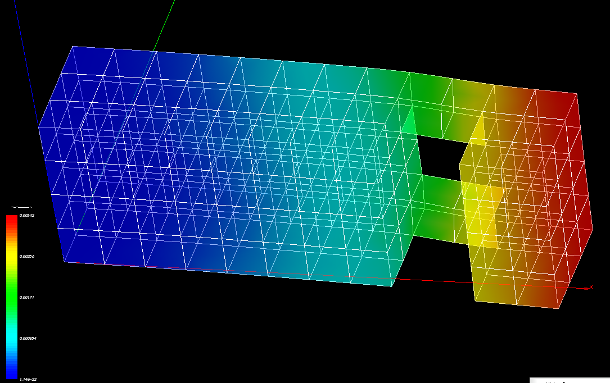
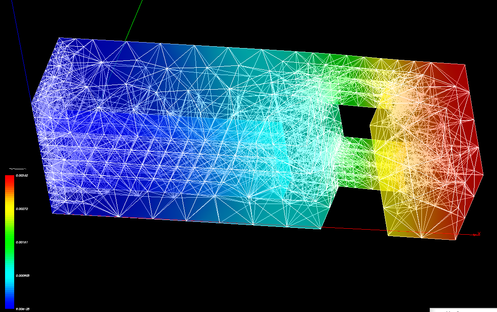
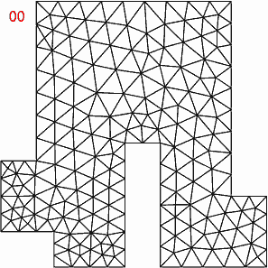
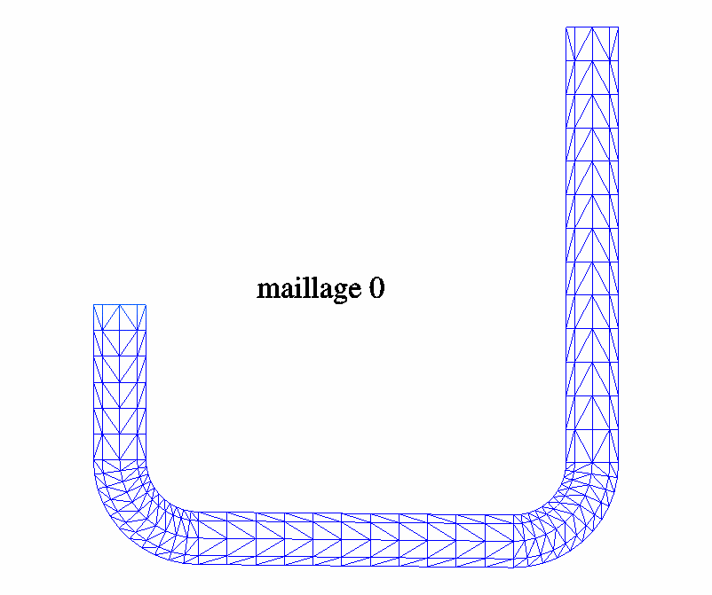

.. _applications:

.. index:: single: application
.. index:: single: illustration

Applications
============
On trouvera ici des exemples d'applications d'adaptation de maillage avec HOMARD.

Mécanique non linéaire
""""""""""""""""""""""

La pièce est encastrée sur sa gauche. On appuie sur le haut de la seconde bosse, avec un chargement variant au cours du temps. Le véritable bord de la pièce est arrondi. Sur le maillage initial, ce bord est très grossièrement représenté. Au fil des adaptations, quand le maillage est raffiné sur le bord, on place les nouveaux noeuds sur le véritable bord. Ainsi, la géométrie est respectée au plus proche.

Ce calcul est réalisé avec `Code_Aster <http://www.code-aster.org>`_. La loi utilisée est Von Mises isotrope. Le transitoire dure 480 s, avec un pas de temps de 3s. Il est découpé en 32 calculs. Le calcul numéro k va de t=0 à t=15*k s. Le maillage est adapté à l'instant final, t=15*k s. Puis on reprend à partir de 0. Cette stratégie permet de produire un maillage adapté à tous les instants du transitoire et de n'avoir aucune interpolation à faire.

.. image:: ../images/appli_01.gif
   :align: center

Des hexaèdres en mécanique
""""""""""""""""""""""""""

La pièce représente un piton encastré dans un mur. On suspend une charge au crochet à droite.
L'adaptation a entraîné la création de nouveaux hexaèdres ainsi que des tétraèdres et des pyramides
dans les zones de transition entre les différents niveaux de raffinement. Ce calcul est réalisé avec `Code_Aster <http://www.code-aster.org>`_.

Niveau 0 :
----------

Niveau 9 :
----------

Convection d'un polluant
""""""""""""""""""""""""

Cet exemple simule le passage d'un polluant dans un courant d'eau.
L'écoulement entre dans la structure en bas à gauche, monte pour contourner l'obstacle, puis sort en bas à droite.

On sait que dans ce genre de calculs, la difficulté réside dans la précision du calcul autour du polluant transporté.
Grâce à l'adaptation de maillage avec HOMARD, à chaque instant, le maillage est optimal dans les zones délicates. On constate en effet que le maillage se raffine en amont de la présence du polluant. Ce maillage reste fin au centre de la zone à forte concentration en polluant, pour améliorer la précision du calcul dans cette zone. Enfin le maillage est déraffiné à l'arrière, une fois que le polluant est passé.

Stratification thermique
""""""""""""""""""""""""

Cet exemple simule une stratification thermique dans un courant d'eau.
L'écoulement entre dans la structure en haut à gauche, descend, puis sort en haut à droite. Par suite de différences de température, la masse volumique du fluide n'est pas identique partout ; la gravité crée ainsi des strates dans le fluide.

L'adaptation de maillage permet d'affiner le maillage dans les zones de fort gradient thermique.
Sur la figure ci-contre, on peut voir le tracé du maillage colorié par le niveau de température, jusqu'à l'établissement d'un
régime permanent.

