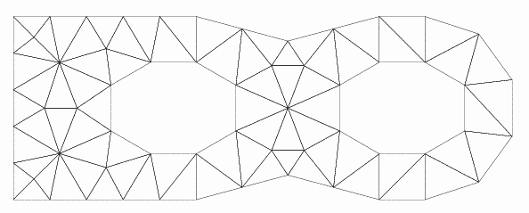

.. _gui_applications:

.. index:: single: application
.. index:: single: illustration

Applications
============
On trouvera ici des exemples d'applications d'adaptation de maillage avec HOMARD.

Quelques illustrations de maillage adaptés
""""""""""""""""""""""""""""""""""""""""""

+---------------------------------------------------------------+
+---------------------------------------------------------------+
|                                                               |
| .. image:: ../images/intro_3.png                              |
|    :align: center                                             |
|                                                               |
+---------------------------------------------------------------+
|                                                               |
| .. image:: ../images/intro_4.png                              |
|    :align: center                                             |
|                                                               |
+---------------------------------------------------------------+
|                                                               |
| .. image:: ../images/intro_5.png                              |
|    :align: center                                             |
|                                                               |
+---------------------------------------------------------------+
|                                                               |
| .. image:: ../images/intro_6.png                              |
|    :align: center                                             |
|                                                               |
+---------------------------------------------------------------+
|                                                               |
| .. image:: ../images/intro_7.png                              |
|    :align: center                                             |
|                                                               |
+---------------------------------------------------------------+
|                                                               |
| .. image:: ../images/intro_8.gif                              |
|    :align: center                                             |
|                                                               |
+---------------------------------------------------------------+

Mécanique non linéaire
""""""""""""""""""""""

La pièce est encastrée sur sa gauche. On appuie sur le haut de la seconde bosse, avec un chargement variant au cours du temps. Le véritable bord de la pièce est arrondi. Sur le maillage initial, ce bord est très grossièrement représenté. Au fil des adaptations, quand le maillage est raffiné sur le bord, on place les nouveaux noeuds sur le véritable bord. Ainsi, la géométrie est respectée au plus proche.

Ce calcul est réalisé avec Code_Aster. La loi utilisée est Von Mises isotrope. Le transitoire dure 480 s, avec un pas de temps de 3s. Il est découpé en 32 calculs. Le calcul numéro k va de t=0 à t=15*k s. Le maillage est adapté à l'instant final, t=15*k s. Puis on reprend à partir de 0. Cette stratégie permet de produire un maillage adapté à tous les instants du transitoire et de n'avoir aucune interpolation à faire.

