.. _demarrage_rapide:

Démarrage rapide
################
.. index:: single: démarrage
.. index:: single: exemple

L'ensemble des options de pilotage du module HOMARD dans SALOME est décrit dans le :doc:`gui_usage`. Mais on trouvera ici le B.A. BA pour découvrir l'utilisation de HOMARD à partir d'un exemple simple.

Imaginons que l'on a effectué un calcul de thermique sur un maillage donné. On a récupéré en sortie de ce calcul un fichier au format MED, contenant le maillage et le champ des températures aux noeuds. On aimerait adapter le maillage de telle sorte que l'écart de température entre deux noeuds voisins soit inférieur à une valeur donnée.

La première action nécessite de lancer le module HOMARD, en créant une nouvelle étude, selon le principe qui a été retenu pour tous les autres modules de SALOME.

.. image:: images/homard_1.png
   :align: center
   :alt: HOMARD - lancement
   :width: 560
   :height: 150

Une fois le module HOMARD activé, on crée un cas par le choix "*Nouveau cas*" dans le menu HOMARD.

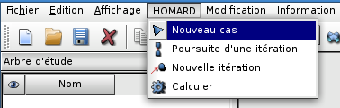

La fenêtre suivante apparaît :

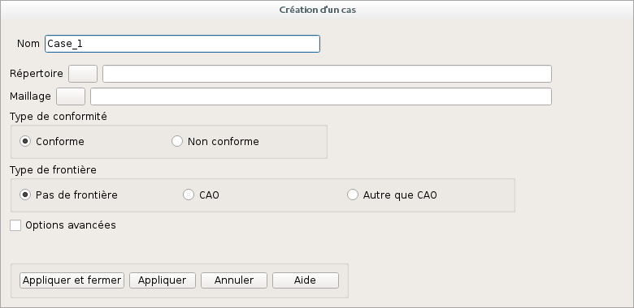

Il faut fournir deux informations : le répertoire qui contiendra les fichiers produits par les adaptations successives et le fichier MED issu du calcul que l'on vient de faire. Dans ce cas, on laissera les options par défaut de conformité du maillage et de non prise en compte de frontières courbes. On valide par "Appliquer et fermer".

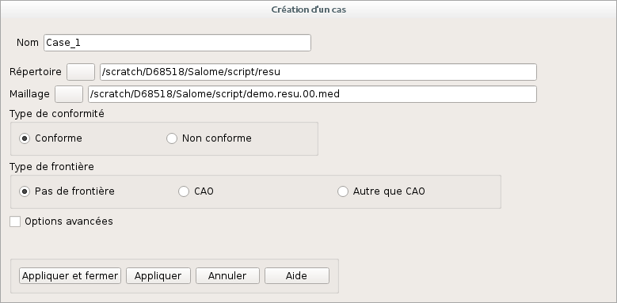

L'arbre d'études est enrichi de ce cas. On déplie le cas jusqu'à afficher le maillage correspondant à l'itération 0. On désigne cette itération initiale et on demande une nouvelle itération par "*Nouvelle itération*" dans le menu HOMARD ou à la souris.

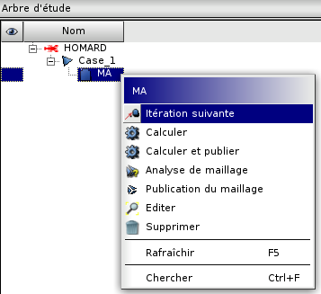

La fenêtre suivante apparaît :

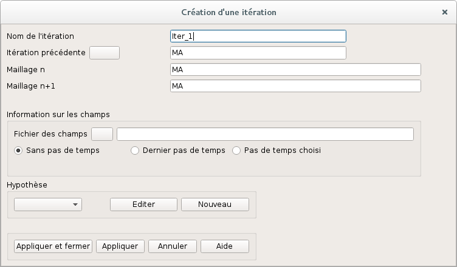

On désigne le fichier issu du calcul que l'on vient de faire et qui contient le champ de température. C'est le même que celui qui a été donné dans la définition du cas.

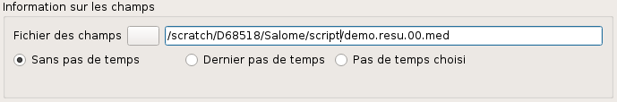

On clique sur "Nouveau" dans la rubrique hypothèse. La fenêtre suivante apparaît :

.. image:: images/intro_35.png
   :align: center
   :alt: Fenetre
   :width: 769
   :height: 775

On modifie les options par défaut pour correspondre à notre choix de pilotage de l'adaptation. La sélection d'un pilotage par les sauts entre éléments et d'un seuil absolu de 4.0 va demander le découpage de chaque arête de maille où le température varie de plus de 4.0 degrés entre les deux extrémités de l'arête.

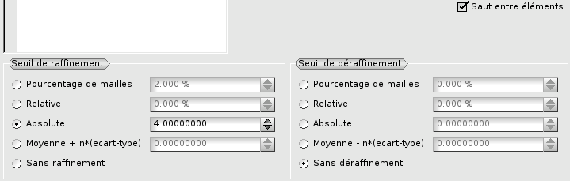

On valide par "Appliquer et fermer" cette création d'hypothèse, puis la création de la nouvelle itération. On se retrouve avec un arbre d'études enrichi avec la description de l'hypothèse créée et de l'itération à calculer, repérée par une icone "en attente".

Lancer l'adaptation s'obtient en sélectionnant l'itération à calculer. On choisit ensuite "*Calculer*" dans le menu HOMARD ou à la souris. L'arbre d'études s'enrichit de fichiers d'informations et du nom du fichier au format MED qui contient le nouveau maillage, ``maill.01.med``. On remarque qu'il est placé dans le répertoire qui a été désigné à la création du cas.

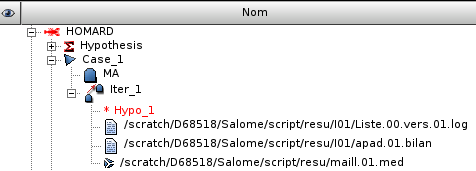

A ce stade, on va utiliser ce nouveau maillage pour un deuxième calcul, dans les mêmes conditions que le premier. Une fois que ce nouveau calcul est achevé, on peut décider de poursuivre le processus d'adaptation. Pour cela on revient dans SALOME et on active le module HOMARD. On désigne l'itération que l'avait calculée précédemment "*Iter_1*" et on demande une nouvelle itération. La fenêtre suivante apparaît :

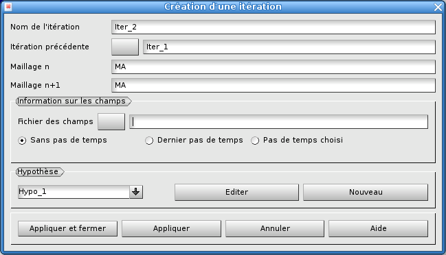

Comme on continue l'adaptation avec le même critère de saut de température entre noeuds voisins, on garde l'hypothèse "*Hypo_1*". Il suffit de désigner le fichier issu du calcul que l'on vient de faire et qui contient le nouveau champ de température.

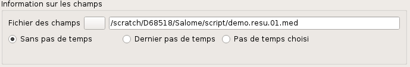

Comme précédemment, on lance l'adaptation et on récupère les résultats dans le répertoire du cas, dont le maillage ``maill.02.med``.

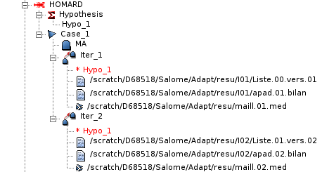

On peut alors lancer un nouveau calcul sur ce nouveau maillage et poursuiver cette alternance calcul/adaptation jusqu'à l'obtention du résultat attendu.

