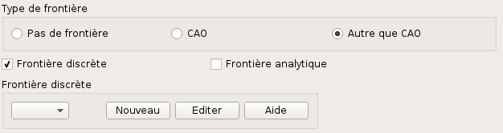
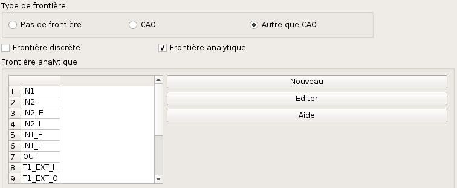
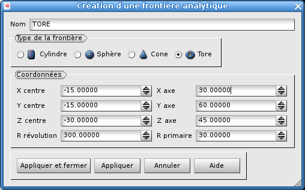
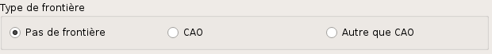

.. _gui_create_boundary:

La frontière
############
.. index:: single: boundary
.. index:: single: frontière

L'objet frontière contient toutes les définitions géométriques permettant de décrire une frontière courbe à suivre.

Il existe deux modes de description d'une frontière :

  - Discrète : ce mode est utilisé pour décrire une courbe 1D
  - Analytique : ce mode est utilisé pour décrire une surface

Frontière discrète
******************

Le suivi d'une frontière discrète se fera en sélectionnant une frontière choisie dans la liste des frontières discrètes existantes.

Au démarrage, la liste est vide. Il faut créer une première frontière discrète par activation du bouton "*Nouveau*" :

La fenêtre proposée invite au choix d'un fichier de maillage. Ce maillage est celui de toutes les lignes constituant la frontière. Un nom de frontière est proposé automatiquement : Boun_1, Boun_2, etc. Ce nom peut être modifié. Il ne doit pas avoir déjà été utilisé pour une autre frontière.

.. image:: images/create_boundary_di_2.png
   :align: center

.. note::
  Le fichier ne doit contenir qu'un seul maillage.

Si des frontières discrètes ont déjà été définies pour un autre cas, on peut sélectionner l'une d'elles. On peut également créer une nouvelle frontière discrète par activation du bouton "*Nouveau*", comme expliqué précédemment.

.. image:: images/create_boundary_di_3.png
   :align: center

Frontière analytique
********************
Au démarrage, SALOME affiche un tableau avec un seule colonne. Cette colonne contient la liste de tous les groupes du maillage initial définissant le cas.

Il faut créer une première frontière analytique par activation du bouton "*Nouveau*". On aura le choix entre cylindre, sphère, cône ou tore. Une fois que la frontière sera validée, son nom figurera en en-tête d'une deuxième colonne.

.. image:: images/create_boundary_an_2.png
   :align: center

Il faut maintenant établir le lien entre le maillage définissant le cas et cette frontière décrite analytiquement. Cela se fait en cochant les groupes des faces qui doivent se trouver sur la frontière.

.. image:: images/create_boundary_an_3.png
   :align: center

Cette opération est répétée autant de fois que l'on souhaite placer des faces du maillages sur une surface courbe :

.. image:: images/create_boundary_an_4.png
   :align: center

.. note::

  Un groupe peut très bien ne jamais être coché : cela signifie que les mailles qu'il définit n'appartiennent à aucune des frontières décrites.

  Un groupe ne peut être coché qu'une seule fois. En effet, des mailles surfaciques ne peuvent pas appartenir à plus d'une surface.

  Plusieurs groupes peuvent être cochés pour une même frontière. Cela arrive quand le maillage initial de la zone a été subdivisé en plusieurs groupes : toutes les mailles surfaciques appartiennent à cette surface mais ont été réparties en plusieurs groupes.

  Inversement, une frontière peut très bien n'être retenue par aucun groupe. Cela arrive si elle a été définie pour un cas précédent et qu'elle est sans objet pour le cas en cours de définition.

Il existe quatre types de frontière analytique :

  - Cylindre
  - Sphère
  - Cône, décrit par un axe et un angle ou par deux rayons
  - Tore

.. note::
  Les valeurs numériques proposées par défaut tiennent compte de la géométrie du maillage.

Un cylindre
===========
.. index:: single: cylindre

Le cylindre est défini par un point de l'axe, son axe et son rayon. L'axe est défini par un vecteur. La norme de ce vecteur n'est pas nécessairement égale à 1 ; de même, son orientation n'a aucune importance. Un nom de frontière est proposé automatiquement : Boun_1, Boun_2, etc. Ce nom peut être modifié. Il ne doit pas avoir déjà été utilisé pour une autre frontière.

.. image:: images/create_boundary_an_cy.png
   :align: center

Une sphère
==========
.. index:: single: sphere

La sphère est définie par son centre et son rayon. Un nom de frontière est proposé automatiquement : Boun_1, Boun_2, etc. Ce nom peut être modifié. Il ne doit pas avoir déjà été utilisé pour une autre frontière.

.. image:: images/create_boundary_an_sp.png
   :align: center

Un cône
=======
.. index:: single: cone

Un cône est défini de deux manières différentes : le centre, l'axe et l'angle d'ouverture en degré ou par deux points centrés sur l'axe et le rayon associé. Un nom de frontière est proposé automatiquement : Boun_1, Boun_2, etc. Ce nom peut être modifié. Il ne doit pas avoir déjà été utilisé pour une autre frontière.

Création par une origine, un axe et un angle d'ouverture :

.. image:: images/create_boundary_an_co_1.png
   :align: center

Création par deux points centrés sur l'axe et le rayon associé :

.. image:: images/create_boundary_an_co_2.png
   :align: center

Un tore
=======
.. index:: single: tore

Le tore est défini par son centre, son axe, le rayon de révolution et le rayon primaire. L'axe est défini par un vecteur. La norme de ce vecteur n'est pas nécessairement égale à 1 ; de même, son orientation n'a aucune importance. Un nom de frontière est proposé automatiquement : Boun_1, Boun_2, etc. Ce nom peut être modifié. Il ne doit pas avoir déjà été utilisé pour une autre frontière.

L'arbre d'étude
***************
.. index:: single: arbre d'étude

A l'issue de cette création de frontières, l'arbre d'études a été enrichi. On y trouve toutes les frontières créées, identifiées par leur nom, avec la possibilité de les éditer.

Méthodes python correspondantes
*******************************
Consulter : :doc:`tui_create_boundary`

