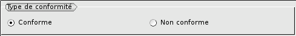
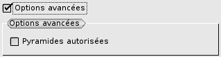
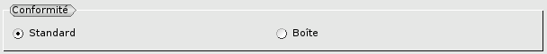
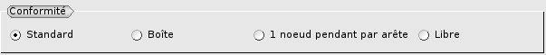
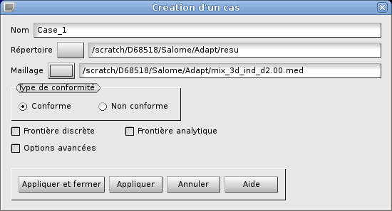
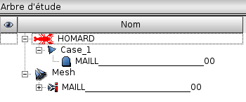

.. _gui_create_case:

La création d'un cas
####################
.. index:: single: cas

La définition du cas se fait par la donnée des informations suivantes :

  - Un nom
  - Un répertoire
  - Le fichier du maillage initial
  - Le type de conformité pour la série d'adaptations envisagées
  - Les éventuelles frontières courbes à respecter

.. image:: images/intro_32.png
   :align: center

Le nom du cas
*************
Un nom de cas est proposé automatiquement : Case_1, Case_2, etc. Ce nom peut être modifié. Il ne doit pas avoir déjà été utilisé pour un autre cas.

Le répertoire
*************
Le répertoire est celui qui contiendra les fichiers produits par les adaptations successives. Par défaut, rien n'est proposé. Le choix est fait, soit en tapant le nom dans la zone de texte, soit en activant la fonction de recherche. C'est dans ce répertoire que seront exportés les maillages au format MED, dans des fichiers de nom ``maill.xx.med``, où ``xx`` est un numéro d'ordre créé automatiquement. Ces fichiers seront visibles dans l'arbre d'études.

.. image:: images/create_case_2.png
   :align: center

.. index:: single: maillage;initial
.. index:: single: MED

Le maillage initial
*******************
Le maillage initial doit se trouver dans un fichier au format MED. Classiquement, il aura été produit par le logiciel de calcul avec lequel on travaille. Mais il peut également avoir été créé avec le module SMESH et exporté au format MED. Le nom du fichier peut être fourni, soit en tapant le nom dans la zone de texte, soit en activant la fonction de recherche.

.. image:: images/create_case_3.png
   :align: center

.. note::
  Le fichier ne doit contenir qu'un seul maillage.

.. warning::
  Le maillage ne doit pas être lui-même le produit d'une adaptation de maillage par HOMARD, sous peine de perdre la cohérence entre les différents niveaux de raffinement/déraffinement

.. index:: single: type de conformité

Le type de conformité
*********************
Les itérations qui seront calculées pour ce cas devront toutes respecter le même comportement vis-à-vis de la conformité.

L'option par défaut, 'conforme', implique que les maillages produits par HOMARD seront conformes au sens des éléments finis. C'est le choix classique de la plupart des logiciels de simulation par éléments finis.

Il est possible également de traiter des maillages non conformes.

Des variantes peuvent être obtenues avec les options avancées.

.. index:: single: frontière

Les frontières courbes
**********************
Quand le bord du domaine est courbe, HOMARD sait placer les nouveaux noeuds sur ces frontières pour éviter des singularités artificielles. Cette technique est aussi applicable à une courbure intérieure à un domaine.

Deux cas de figure sont présents :

* courbe 1D : cette courbe peut être définie dans un plan, par exemple pour un calcul 2D. Elle peut également être définie dans l'espace 3D, par exemple pour l'intersection de deux surfaces. Une ligne à suivre est décrite de manière discrète.
* surface : une surface à suivre est décrite de manière analytique.

On cochera le ou les boutons voulus :

.. image:: images/create_case_5.png
   :align: center

La définition des frontières est décrite dans :doc:`gui_create_boundary`.

.. index:: single: pyramide

.. _options_avancees:

Les options avancées
********************
Par défaut, aucune option avancée n'est active. Néanmoins, on peut définir quelques options avancées.

Les pyramides
=============

La première concerne la gestion des mailles pyramidales.

Par défaut, HOMARD sait traiter des maillages en 2 ou 3 dimensions et comportant les mailles suivantes :
   - mailles-points
   - segments
   - triangles
   - quadrangles
   - tétraèdres
   - hexaèdres
   - prismes

Si le maillage initial comporte des pyramides, il y a arrêt en erreur. Toutefois, si on est certain que les raffinements ultérieurs ne toucheront aucune des arêtes des pyramides, on cochera la case "Pyramides autorisées". Les adaptations se dérouleront normalement et les pyramides seront restituées telles quelles dans le maillage final.

Quelle conformité ?
===================

Pour un raffinement conforme, on a le choix entre le raffinement conforme standard, option par défaut, ou un raffinement par boîte, c'est-à-dire interdisant le raffinement en escalier.

Quelle non-conformité ?
=======================

Pour un raffinement non conforme, on a le choix entre 4 possibilités :
* raffinement conforme standard, option par défaut
* raffinement par boîte, c'est-à-dire interdisant le raffinement en escalier
* 1 noeud par arête : chaque arête d'une maille peut être découpée sans que la maille voisine par cette arête ne le soit.
* quelconque : aucune limitation sur les raccords de conformité d'une maille à l'autre.

Le format externe
=================
.. index:: single: MED
.. index:: single: Saturne

Par défaut le format des mailles externes est le format MED. Dans le cas d'un calcul Saturne 2D, on doit le préciser ici pour gérer correctement le caractère pseudo-2D du maillage.

La poursuite d'un cas
*********************
.. index:: single: poursuite
.. index:: single: YACS

La poursuite d'un cas correspond à la situation suivante :
Une série d'adaptations ont été conduites sur un cas puis SALOME est fermé. On a gardé les répertoires de travail de ces itérations. On souhaite ensuite reprendre ces itérations pour les poursuivre là où on s'est arrêté. Cette fonctionnalité est particulièrement utile dans le cas de schémas YACS pour lesquels on scinde en plusieurs parties une longue série d'adaptations.

La condition pour reprendre une itération est d'avoir conservé dans un même répertoire deux fichiers :
   - le fichier de configuration qui a servi de données au module exécutable de HOMARD ; ce fichier se présente sous la forme ``HOMARD.Configuration.(n).vers.(n+1)``
   - le fichier au format MED qui conserve l'historique des adaptations réalisées ; ce fichier se présente sous la forme ``maill.(n).hom.med``

On peut choisir de partir d'une itération archivée désignée explicitement par son répertoire ou d'une itération repérée dans le répertoire archivant un cas.

Pour poursuivre une itération connue par son répertoire d'archive, la définition du cas se fait par la donnée des informations suivantes :

  - Un nom
  - Un répertoire
  - Le répertoire qui contient les archives

.. image:: images/pursue_case_1.png
   :align: center

On peut choisir de partir d'un cas déjà calculé ; par défaut, le nouveau cas sera créé en partant de la dernière itération précédemment calculée.

.. image:: images/pursue_case_2.png
   :align: center

Si on souhaite partir d'une itération qui ne soit pas la dernière, il suffit de le préciser :

.. image:: images/pursue_case_3.png
   :align: center

.. note::
  Les paramétrages du cas ainsi créé sont ceux de l'itération poursuivie : mode de conformité identique par exemple.

L'arbre d'étude
***************
A l'issue de cette création de cas, l'arbre d'études a été enrichi de ce nouveau cas. On y trouve l'itération initiale, identifiée par le nom du maillage qui a été lu dans le fichier fourni.

Méthodes python correspondantes
*******************************
Consulter :doc:`tui_create_case`

