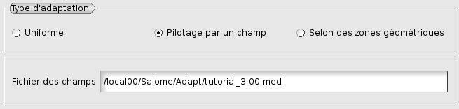
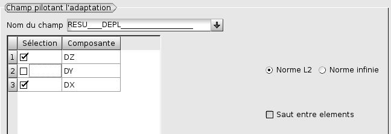
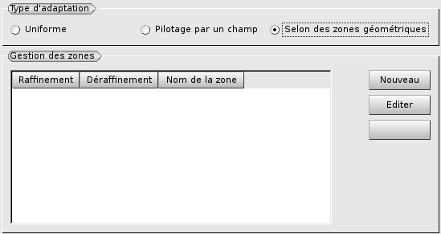
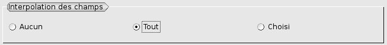
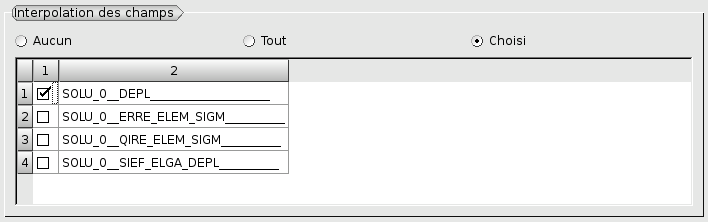
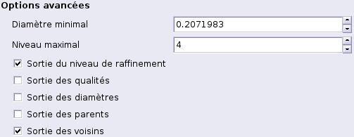

.. _gui_create_hypothese:

L'hypothèse
###########
.. index:: single: hypothèse

L'hypothèse contient toutes les paramètres de pilotage d'une adaptation d'un maillage. Cette opération permet de réaliser l'itération à laquelle elle est attachée.

Il existe trois classes d'hypothèses :

  - Uniforme sur tout le maillage,
  - Selon un champ,
  - En fonction de zone géométrique.

.. image:: images/create_hypothese_1.png
   :align: center

Nom de l'hypothèse
******************
Un nom d'hypothèse est proposé automatiquement : Hypo_1, Hypo_2, etc. Ce nom peut être modifié. Il ne doit pas avoir été utilisé pour une hypothèse précédente.

Adaptation uniforme
*******************
Par défaut on propose un raffinement uniforme. Quand on part d'un maillage qui a déjà été raffiné, l'option de déraffinement supprimera les mailles produites.

Adaptation selon un champ
*************************

.. note::
  Pour pouvoir adapter le maillage selon un champ il faut avoir au préalable désigné le fichier med contenant le champ. Cela se fait dans la fenêtre de construction de l'itération (voir :doc:`gui_create_iteration`). Le nom du fichier qui a été sélectionné est affiché sans modification possible ici :

Le champ voulu est à choisir dans la liste des champs contenus dans le fichier.
Une fois ce champ choisi, la liste des ses composantes s'affiche. Il suffit de désigner la (ou les) composantes désirées.

Si l'on choisit une seule composante, par défaut, c'est sa valeur absolue qui sera utilisée, mais il est possible d'utiliser la valeur relative. Dans le cas de plusieurs composantes, par défaut HOMARD utilisera la norme L2 (euclidienne). On peut toutefois choisir d'utiliser la norme infinie (le max des valeurs absolues des composantes).

On peut choisir de ne pas utiliser directement le champ, mais sa variation d'un élément à ses voisins. Pour cela, on activera le bouton "*Saut entre éléments*".

Le raffinement se fait selon un seuil qui définit un critère haut de raffinement. Toutes les mailles pour lesquelles l'indicateur est supérieur à ce critère seront raffinées.
Pour le choix du critère, quatre variantes sont possible :

  - selon un pourcentage de mailles à raffiner, nombre réel compris entre 0 et 100 ; HOMARD raffinera les x% des mailles qui ont la plus grande valeur du champ.
  - selon une valeur relative du champ, nombre compris entre 0 et 100 ; HOMARD raffinera les mailles où le champ est supérieur à x% de l'intervalle [mini,maxi].
  - au delà d'une valeur absolue ; toutes les mailles avec une valeur de champ supérieure à cette valeur seront raffinées.
  - au delà d'une valeur absolue valant la moyenne de la répartition du champ augmentée de n fois son écart-type ; toutes les mailles avec une valeur de champ supérieure à cette valeur seront raffinées.

La même convention s'applique au déraffinement, en remplaçant supérieur par inférieur. On peut inactiver une des fonctions (raffinement ou déraffinement) en cochant le bouton ad_hoc.

.. image:: images/create_hypothese_ch_3.png
   :align: center

Adaptation selon une zone
*************************
.. index:: single: zone

Au démarrage, il faut créer une première zone par activation du bouton "*Nouveau*" (voir :doc:`gui_create_zone`) :

Lorsque des zones ont déjà été créées, la liste apparaît dans la fenêtre, ce qui permet de sélectionner les zones voulues. On doit alors préciser si une zone est utilisée pour raffiner toutes les mailles dont une arête est contenue dans la zone, ou si la zone est utilisée pour déraffiner les mailles intérieures à la zone. Si aucun choix n'est fait, la zone est ignorée dans cette hypothèse.

.. image:: images/create_hypothese_zo_2.png
   :align: center

Filtrage par les groupes
************************
.. index:: single: groupe

On peut restreindre l'application de l'hypothèse d'adaptation à des groupes. Ainsi les mailles n'appartenant pas à ces groupes ne seront pas modifiées, sauf par contamination ultérieure du raffinement pour assurer la conformité du maillage final.
On coche le bouton associé :

.. image:: images/create_hypothese_gr_1.png
   :align: center

La liste des groupes de mailles présents dans le maillage est affichée. Il suffit de cocher ceux voulus pour restreindre l'hypothèse d'adaptation.

.. image:: images/create_hypothese_gr_2.png
   :align: center

Interpolation de champs
***********************
.. index:: single: interpolation

.. note::
  Pour pouvoir interpoler un champ de l'ancien vers le nouveau maillage, il faut avoir au préalable désigné le fichier med contenant le champ. Cela se fait dans la fenêtre de construction de l'itération (voir :doc:`gui_create_iteration`).

Par défaut, aucun champ n'est interpolé. A contrario, on peut demander l'interpolation de tous les champs présents dans le fichier fourni :

Si on veut choisir les champs à interpoler, il faut les cocher dans la liste de tous les champs présents dans le fichier fourni :

Les options avancées
********************
Si la case "Options avancées" n'est pas cochée, aucune contrainte supplémentaire n'est définie.
Si la case est cochée, on définira les options avancées.

Une première série d'options portent sur la finesse maximale de maillage que l'on ne veut pas dépasser. Deux directives sont possibles, séparément ou ensemble. On peut imposer une taille de maille minimale : une maille dont le diamètre est inférieur à cette limite ne sera plus découpée. Par défaut, on propose un diamètre minimal nul, ce qui revient à ne rien imposer. On peut imposer un niveau de raffinement maximal. Par défaut, le maximum est à 99, ce qui équivaut en général à ne rien imposer.

La deuxième série d'options n'a d'intérêt que dans le cas où l'adaptation est piloté par un champ et que ce champ n'est pas défini partout dans le maillage. Cela arrive par exemple quand on construit un champ basé sur une distance dans un plan alors que le domaine est 3D : le champ ne sera pas défini sur les noeuds hors du plan. Pour de tels champs, cette option permet de préciser le comportement que l'on souhaite dans les régions où le champ n'est pas défini. Par défaut, il ne se passe rien : les mailles sont gardées telles quelles. On peut choisir les deux autres variantes : raffiner, toutes les mailles seront a priori coupées, ou déraffiner, toutes les mailles seront candidates au déraffinement.

Le dernier choix porte sur des sorties supplémentaires de l'adaptation. Par défaut, aucune case n'est cochée et aucun champ n'est produit. Si l'une des cases est cochée, le fichier MED en sortie contiendra des champs supplémentaires. Le premier choix représente le niveau de raffinement de chaque maille. La convention est celle de HOMARD : une maille du maillage initial est de niveau 0, une maille issue d'un raffinement d'une maille initiale porte le niveau 1, etc. Les mailles de transition qui sont produites entre deux mailles de niveau différents, n et n+1, sont affectées du demi-niveau n+0,5. Le deuxième choix porte sur la qualité des mailles. Le troisième choix produira le diamètre des mailles.

L'arbre d'étude
***************
.. index:: single: arbre d'étude

L'arbre d'études contient les hypothèses créées et les itérations qui les utilisent. La description des zones qui leur sont éventuellement attachées est présente.

.. image:: images/create_hypothese_2.png
   :align: center

Méthodes python correspondantes
*******************************
Consulter :doc:`tui_create_hypothese`
