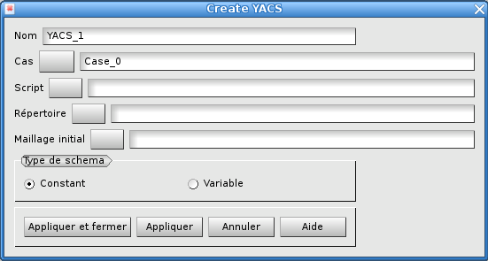

.. _gui_create_yacs:

Le schéma YACS
##############
.. index:: single: YACS
.. index:: single: cas

L'objet YACS contient toutes les définitions permettant de créer un schéma. Ce schéma va piloter l'alternance d'un calcul représentant une modélisation physique sur un maillage et l'adaptation de ce maillage de calcul. Cette alternance est piloté par des critères de convergence.

.. note::
  Pour avoir une description détaillée de chacune des rubriques formant le schéma, consulter :ref:`yacs`

Procédure à employer
********************
La création automatique du schéma va se faire en trois phases :

- Au départ, il faut avoir fait un calcul sur un tout premier maillage. Ce calcul aura produit des résultats dans un fichier MED.
- Ensuite, on crée un cas dans le module HOMARD, tel qu'il est décrit dans :ref:`gui_create_case`. Dans ce cas, on crée une itération suivante du maillage en définissant une hypothèse d'adaptation ; voir :ref:`gui_create_iteration`.
- Enfin, de ce cas, on va créer le schéma qui se basera sur l'hypothèse d'adapation définie.

Nom du schéma
*************
Un nom de schéma est proposé automatiquement : YACS_1, YACS_2, etc. Ce nom peut être modifié. Il ne doit pas avoir été déjà utilisé pour un autre schéma.

Le script
*********

Le fichier contenant le script qui permet de lancer le calcul lié à la modélisation physique est fourni ici. C'est un script python qui doit respecter les règles suivantes :

- le nom de la classe qui gère le calcul est ``Script``
- le lancement du calcul se fait par la méthode ``Compute()``
- le résultat du calcul est sous la forme de trois variables : le code d'erreur, un message, un dictionnaire python.

S'ils sont nécessaires à la création de la classe, on peut passer des arguments sous la forme :

- ``--rep_calc=rep_calc``, où ``rep_calc`` est le répertoire de calcul
- ``--num=num``, où ``num`` est le numéro du calcul  : 0 pour le tout premier, puis 1, 2 etc.
- ``--mesh_file=meshfile``, où ``meshfile`` est le fichier contenant le maillage sur lequel calculer.
- ``-v``, pour des messages

Les arguments de retour :

- ``erreur`` : le code d'erreur, entier : 0 si le calcul est correct, non nul sinon
- ``message`` : un éventuel message d'information sur le calcul
- ``dico_resu`` : un dictionnaire python qui comprend a minima les deux clés suivantes : ``FileName`` est la clé pour le nom du fichier MED qui contient les résultats du calcul, ``V_TEST`` est la clé pour la valeur réelle à tester.

Exemple d'usage du script :
::

    argu = ["--rep_calc=" + rep_calc)]
    argu.append("--num=%d" % numCalc)
    argu.append("--mesh_file="  + MeshFile)
    Script_A = Script(argu)
    erreur, message, dico_resu = Script_A.compute ()

.. note::

  * Pour piloter Code_Aster : :download:`ScriptAster<../files/yacs_script.py>`

Le répertoire
*************
Le répertoire est celui qui contiend les fichiers produits par le calcul. Par défaut, rien n'est proposé. Le choix est fait, soit en tapant le nom dans la zone de texte, soit en activant la fonction de recherche.

Le maillage initial
*******************
Le maillage initial doit se trouver dans un fichier au format MED. C'est celui qui est le point de départ du tout premier calcul. Le nom du fichier peut être fourni, soit en tapant le nom dans la zone de texte, soit en activant la fonction de recherche.

Le type de schéma
*****************
Plusieurs types de schéma sont proposés : constant ou variable.

L'option par défaut, 'constant', alterne le lancement d'un calcul qui est toujours le même et une adaptation de maillage : d'un calcul à l'autre, la seule chose qui change est le maillage. Tout le reste est identique. Par exemple, dans le cas où le calcul modéliserait un transitoire, c'est toujours l'intégralité du transitoire qui est prise en compte.

L'option 'variable' est inactive aujourd'hui.

Méthodes python correspondantes
*******************************
Consulter :ref:`tui_create_yacs`
