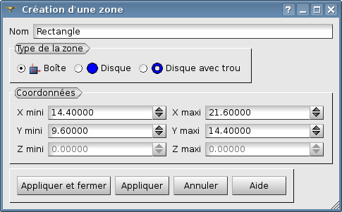
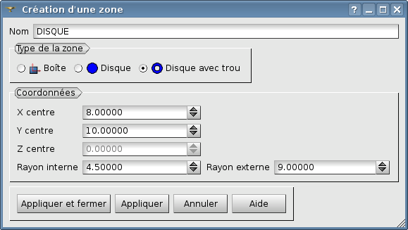
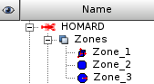

.. _gui_create_zone:

La zone
#######
.. index:: single: zone
.. index:: single: 2D

L'objet zone contient toutes les définitions géométriques permettant de décrire une zone à raffiner.

En 3D, il existe quatre types de zone :

  - Parallélépipède
  - Cylindre
  - Tuyau
  - Sphère

Leurs analogues en 2D sont :

  - Rectangle
  - Disque
  - Disque percé

Le principe du raffinement selon des zones est le suivant. Chaque arête de maille dont les deux extrémités
sont incluses dans une même zone sera coupée. Ensuite HOMARD applique l'algorithme de traitement de la
conformité pour produire un maillage correct.

.. note::
  Les valeurs proposées par défaut pour les dimensions des zones tiennent compte de la géométrie du maillage.

Nom de la zone
**************
Un nom de zone est proposé automatiquement : Zone_1, Zone_2, etc. Ce nom peut être modifié. Il ne doit pas avoir été déjà utilisé pour une autre zone.

Un parallélépipède
******************
.. index:: single: boite

Le parallélépipède est obligatoirement parallèle aux axes de coordonnées. Il est défini par ses extrêmes dans chaque direction.

.. image:: images/create_zone_1.png
   :align: center

Un cylindre
***********
.. index:: single: cylindre

Le cylindre est défini par son axe, un point de base positionné sur l'axe, sa hauteur et son rayon. L'axe est défini par un vecteur qui doit être correctement orienté : on retiendra le volume partant de la base dans la direction du vecteur jusqu'à la hauteur retenue. La norme de ce vecteur n'est pas nécessairement égale à 1.

.. image:: images/create_zone_2.png
   :align: center

Un tuyau
********
.. index:: single: tuyau

Le tuyau est défini par son axe, un point de base positionné sur l'axe, sa hauteur et ses rayons interne et externe. L'axe est défini par un vecteur qui doit être correctement orienté : on retiendra le volume partant de la base dans la direction du vecteur jusqu'à la hauteur retenue. La norme de ce vecteur n'est pas nécessairement égale à 1.

.. image:: images/create_zone_3.png
   :align: center

Une sphère
**********
.. index:: single: sphere

La sphère est définie par son centre et son rayon.

.. image:: images/create_zone_4.png
   :align: center

Un rectangle
************
.. index:: single: rectangle

Le rectangle est obligatoirement parallèle aux axes de coordonnées. Il est défini par ses extrêmes dans chacune des directions valides. La coordonnée constante est affichée pour information, mais n'est pas modifiable.

Un disque
*********
.. index:: single: disque

Le disque est obligatoirement dans le plan des axes de coordonnées. Il est défini par son centre et son rayon. La coordonnée constante est affichée pour information, mais n'est pas modifiable.

.. image:: images/create_zone_22.png
   :align: center

Un disque avec trou
*******************
.. index:: single: disque avec trou

Le disque avec trou est obligatoirement dans le plan des axes de coordonnées. Il est défini par son centre et ses rayons externe et interne. La coordonnée constante est affichée pour information, mais n'est pas modifiable.

L'arbre d'étude
***************
.. index:: single: arbre d'étude

A l'issue de cette création de zone, l'arbre d'études a été enrichi. On y trouve toutes les zones créées, identifiées par leur nom, avec la possibilité de les éditer.

Méthodes python correspondantes
*******************************
Consulter :doc:`tui_create_zone`
