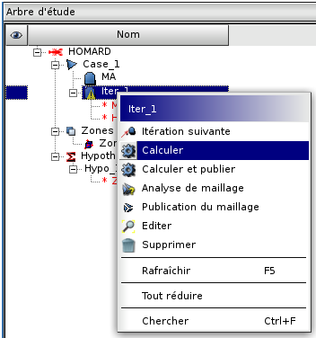
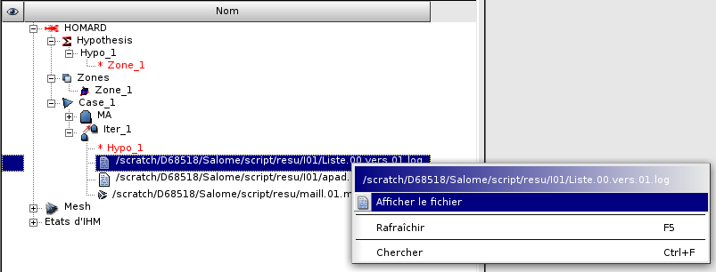

.. _gui_homard:

Le calcul
#########
.. index:: single: itération
.. index:: single: calcul
.. index:: single: SMESH

Lancer une adaptation
*********************
Lancer une adaptation s'obtient en sélectionnant l'itération à calculer. Elle est repérée par une icone "en attente". On choisit ensuite "*Calculer*" ou "*Calculer et publier*" dans le menu HOMARD ou à la souris. Dans le premier cas, l'adaptation sera réalisée et les fichiers MED seront écrits. Dans le second cas, le nouveau maillage sera publié dans SMESH. On notera que si on a seulement utilisé "*Calculer*", il est toujours possible de publier a posteriori le maillage produit en sélectionnant le choix "*Publier*".

.. index:: single: arbre d'étude

L'arbre d'étude
***************

A l'issue de ce calcul, l'arbre d'études a été enrichi. L'icone devant l'itération est validée. Sous l'itération, on trouve la référence aux fichiers de résultats créés, identifiés par leur nom dans le répertoire *rep* qui a été défini à la création du cas :

  - *rep*/I(n+1)/Liste.n.vers.(n+1).log
  - *rep*/I(n+1)/apad.n.vers.(n+1).bilan
  - *rep*/maill.(n+1).med

Les deux premiers fichiers sont des fichiers de texte, éditables. Liste.n.vers.(n+1).log contient des informations sur le déroulement de l'adaptation : récapitulatif du mode d'adaptation, pourcentage de mailles concernées, etc. Le fichier apad.n.vers.(n+1).bilan est un résumé des caractéristiques du maillage obtenu.

Le fichier maill.(n+1).med est celui qui contient le maillage produit au format MED. Si on a demandé la publication, on retrouve ce maillage dans la section de l'arbre d'études du module SMESH. Il est alors visible dans ce module et utilisable ensuite comme tout autre maillage.

.. image:: images/lancement_2.png
   :align: center

Consulter le résultat d'une adaptation
**************************************
Les deux fichiers de texte, Liste.n.vers.(n+1).log et apad.n.vers.(n+1).bilan, sont visibles en les sélectionnant. On choisit ensuite "*Afficher le fichier*" dans le menu HOMARD ou à la souris.

.. note::
  Par défaut, le calcul est lancé avec l'exécutable de HOMARD installé avec SALOME. Si on souhaite utiliser une version privée de HOMARD, pour tester une évolution par exemple, il faut préciser où le nouvel exécutable est disponible. Pour cela, il faut renseigner deux variables d'environnement.
  "*HOMARD_REP_EXE_PRIVATE*" définit le répertoire dans lequel se trouve l'exécutable voulu.
  "*HOMARD_EXE_PRIVATE*" définit le nom de l'exécutable dans ce répertoire, si ce nom est différent de "*homard*".

Méthodes python correspondantes
*******************************
Consulter :doc:`tui_create_iteration`

