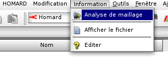

.. _gui_mesh_info:

Analyse de maillage
###################
.. index:: single: analyse
.. index:: single: information

La demande d'analyse d'un maillage se fait par la donnée des informations suivantes :

  - Un répertoire
  - Le fichier du maillage

Si le maillage fait partie d'un cas enregistré, son analyse est faite à partir de son itération dans l'arbre d'études. Voir plus loin.

Maillage à importer
*******************
La sélection de la fonction d'analyse est faite par le menu de la barre supérieure de la fenêtre :

La fenêtre de choix s'affiche.

.. image:: images/mesh_info_2.png
   :align: center

Le nom du cas
=============
Un nom de cas est proposé automatiquement : Case_1, Case_2, etc. Ce nom peut être modifié. Il ne doit pas avoir déjà été utilisé pour un autre cas.

Le répertoire
=============
Le répertoire est celui qui contiendra les fichiers produits par l'information. Par défaut, rien n'est proposé. Le choix est fait, soit en tapant le nom dans la zone de texte, soit en activant la fonction de recherche. C'est dans ce répertoire que seront exportés les fichiers d'information de nom ``Liste.log`` et ``info_av.00.bilan``. Ces fichiers seront visibles dans l'arbre d'études.

.. image:: images/create_case_2.png
   :align: center

.. index:: single: maillage;initial
.. index:: single: MED

Le maillage à analyser
======================
Le maillage à analyser doit se trouver dans un fichier au format MED. Le nom du fichier peut être fourni, soit en tapant le nom dans la zone de texte, soit en activant la fonction de recherche.

.. image:: images/create_case_3.png
   :align: center

.. note::
  Le fichier ne doit contenir qu'un seul maillage.

.. warning::
  Le maillage ne doit pas être lui-même le produit d'une adaptation de maillage par HOMARD, sous peine de perdre l'analyse des différents niveaux de raffinement/déraffinement.

Options d'analyse
=================
L'analyse est faite selon les options cochées.
  - qualité des mailles
  - diamètre des mailles
  - connexité du domaine ; en un seul morceau, combien de trous, etc.
  - tailles des constituants du domaine, groupe par groupe
  - interpénétration des mailles, par dimension

Le résultat de l'analyse est contenu dans le fichier ``info_av.00.bilan`` ; ce fichier est à consulter en l'affichant après sa désignation avec "*Afficher le fichier*" dans le menu HOMARD ou à la souris.

L'arbre d'étude
===============
A l'issue de cette demande d'information, l'arbre d'études a été enrichi de ce nouveau cas. On y trouve l'itération initiale, identifiée par le nom du maillage qui a été lu dans le fichier fourni, et les deux fichiers d'information de nom ``Liste.log`` et ``info_av.00.bilan``.

.. image:: images/mesh_info_3.png
   :align: center

Itération calculée
******************

Pour analyser le maillage produit par une itération d'adaptation de maillage, on désigne à la souris cette itération dans l'arbre d'études et on lance l'analyse. On retrouve le menu similaire au cas initial :

.. image:: images/mesh_info_4.png
   :align: center

Comme pour un maillage importé, l'arbre d'études a été enrichi avec les deux fichiers d'information de nom ``Liste.log`` et ``info_ap.xx.bilan``, où xx est le numéro de l'itération dans le cas.

.. image:: ../images/mesh_info_5.png
   :align: center

Méthodes python correspondantes
*******************************
Consulter :doc:`tui_create_case` et :doc:`tui_create_iteration`

