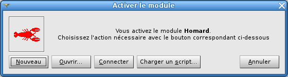

.. _gui_usage:

Mode d'emploi pour l'interface graphique
########################################
.. index:: single: cas
.. index:: single: itération

Activer le module HOMARD
************************
Pour utiliser le module HOMARD, deux façons existent :

#. en activant l'onglet HOMARD dans la liste des modules,
#. en cliquant sur le bouton HOMARD dans la barre d'outils.

L'utilisateur a alors le choix entre créer une nouvelle étude ou en ouvrir une qui a été précédemment enregistrée, selon le principe qui a été retenu pour tous les autres modules de SALOME.

Définir une adaptation
**********************

Une fois que HOMARD a été activé, la permière action consiste à créer un cas. Il s'agit de sélectionner le maillage initial de la suite d'adaptations envisagée (voir :doc:`gui_create_case`). A partir de ce cas, on définira les itérations successives (voir :doc:`gui_create_iteration`) à partir des hypothèses (voir :doc:`gui_create_hypothese`). Les adaptations sont lancées tel que décrit dans :doc:`gui_homard`.

Mode d'emploi de la saisie des données
**************************************

.. toctree::
   :maxdepth: 2

   gui_create_case
   gui_create_iteration
   gui_create_hypothese
   gui_create_zone
   gui_create_boundary
   gui_homard
   gui_mesh_info

Création d'un schéma YACS
*************************

Le module HOMARD propose la création automatique de schémas YACS alternant un calcul et une adaptation de maillage.

.. toctree::
   :maxdepth: 2

   gui_create_yacs
   gui_create_yacs_aster

Préférences
***********

Un certain nombre de choix par défaut pour le module HOMARD sont définis dans les préférences.

.. toctree::
   :maxdepth: 2

   preferences
