.. _intro:

Introduction
############

Présentation générale
*********************
Le logiciel HOMARD est destiné à adapter les maillages dans le cadre des simulations numériques par éléments ou volumes finis. Ce logiciel, réalisé par EDF R&D, procède par raffinement et déraffinement des maillages bidimensionnels ou tridimensionnels. Il est conçu pour être utilisé indépendamment du logiciel auquel il est couplé.

Raffiner le maillage signifie découper des mailles désignées selon des indications fournies par l'utilisateur. Déraffiner le maillage signifie revenir en arrière sur des découpages précédemment réalisés : ainsi, en aucun cas HOMARD ne peut simplifier un maillage existant qui aura été créé trop fin. Le déraffinement prend toute son importance dans les calculs quand la zone d'intérêt se déplace au cours du calcul : on ne tiendra plus compte de raffinements précédemment réalisés et qui deviennent inutiles. On en trouvera une illustration au bas de cette page.

HOMARD sait traiter des maillages en 2 ou 3 dimensions et comportant les mailles suivantes :
   - mailles-points
   - segments
   - triangles
   - quadrangles
   - tétraèdres
   - hexaèdres
   - prismes

Ces mailles peuvent être présentes simultanément. Par exemple, HOMARD saura adapter un maillage comportant des triangles et des quadrangles.
Les noeuds acceptés sont évidemment les noeuds qui sont les sommets des mailles, ce qui correspond à la description classique « en degré 1 » . Si les éléments sont décrits « en degré 2 », les noeuds complémentaires sont gérés. En revanche, il ne peut pas y avoir cohabitation de mailles décrites en degré 1 et d'autres décrites en degré 2. Enfin, HOMARD sait prendre en compte des noeuds isolés, qui n'appartiendraient à aucune définition de mailles : ils ressortiront tels quels du processus d'adaptation.

Le cas des pyramides est à part. Pour un maillage comportant des hexaèdres ou des prismes, la mise en conformité du maillage issu du raffinement crée des pyramides pour assurer la liaison entre deux régions de niveaux de raffinement différents. Ces pyramides sont gérées comme toutes les mailles de transition et ne sont pas redécoupées par la suite. En revanche, si le maillage initial contient des pyramides, HOMARD ne saura pas l'adapter et émettra un message d'erreur. Dans certains cas particuliers, on pourra néanmoins traiter un tel maillage, comme il est décrit dans la rubrique :doc:`options_avancees` de la création du cas.

Plusieurs motivations apparaissent pour adapter un maillage :

  - on veut simplifier la réalisation du maillage d'une géométrie complexe : on part d'un maillage grossier et on confie à un processus automatique la charge de le raffiner.
  - on veut s'assurer de la convergence de la solution numérique : plutôt que de réaliser à la main des maillages de plus en plus fins, on laisse le logiciel chercher lui-même les endroits où il faudrait affiner le maillage pour augmenter la précision du résultat.
  - les conditions du calcul changent au cours de son déroulement : les zones qui doivent être maillées finement se déplacent. Si on maille fin partout dès le début, le maillage est trop gros. En adaptant au fur et à mesure, le maillage ne sera fin qu'aux endroits nécessaires : sa taille sera réduite et la qualité de la solution sera bonne.

Dans tous les cas, le principe de l'adaptation de maillage reste le même. Sur le maillage de départ, on réalise le calcul standard. Avec une analyse de la solution numérique obtenue, on estime l'erreur qui a été commise par rapport à la solution réelle. Cette estimation se représente par une valeur d'indicateur d'erreur dans chaque maille du calcul. A partir de là, on applique le principe suivant : les mailles où l'indicateur d'erreur est fort devraient être plus petites et, réciproquement, les mailles où l'indicateur d'erreur est faible pourraient être plus grandes. Avec cette information, on alimente HOMARD qui va modifier le maillage en conséquence. Sur le nouveau maillage, on recommencera alors le calcul.

Schématiquement, une itération d'adaptation de maillage se présente ainsi. Le logiciel calcule la solution numérique sur le maillage n°k, puis en déduit les valeurs de l'indicateur d'erreur sur tout le maillage. A partir de la connaissance du maillage n°k et de l'indicateur n°k, HOMARD crée le nouveau maillage n°k+1.

.. image:: images/intro_1.png
   :align: center

Au final, la chaîne complète part du maillage initial, puis comprend des maillons successifs (calcul d'indicateur / adaptation). Pour des problèmes stationnaires en temps, cela équivaut à une succession de calculs indépendants sur différents maillages. Pour des problèmes transitoires, le calcul est suspendu à un instant donné ; après adaptation du maillage, le calcul est repris au même instant ou à un instant antérieur.

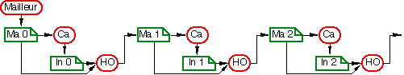

Des variantes de ce schéma de base sont possibles. Si aucun calcul d'erreur n'est disponible dans le logiciel couplé, on peut utiliser un champ pour piloter l'adaptation. Un champ de contraintes en mécaniques peut être utilisé : raffiner là où les contraintes sont importantes est souvent efficace pour améliorer la qualité de la simulation. On peut également adapter en fonction du saut d'une variable d'une maille à sa voisine ou dans une zone connue a priori. Grâce à ses nombreuses options, HOMARD permet d'envisager de multiples scénarios d'adaptation de maillage.

.. note::
  Pour une description plus complète, voir :download:`Description générale de HOMARD <../files/HOMARD_0.pdf>`.

.. note::
  Pour une référence à HOMARD, utiliser :

  G. Nicolas and T. Fouquet, Adaptive Mesh Refinement for Conformal Hexahedral Meshes, "*Finite Elements in Analysis and Design*", Vol. 67, pp. 1-12, 2013, doi:10.1016/j.finel.2012.11.008

  `Accessible en cliquant ici <http://dx.doi.org/10.1016/j.finel.2012.11.008>`_

.. index:: single: YACS

.. note::
  Cet alternance de calculs et d'adaptions est très appropriée à la mise place de schémas :doc:`yacs`.

Mode de découpage des mailles
*****************************
.. index:: single: découpage
.. index:: single: conformité

Globalement le processus de maillage adaptatif par découpage des mailles se résume en deux phases. Dans la première phase, on découpe toutes les mailles qui ont été désignées par les indications de pilotage. Cela produit un maillage qui n'est pas conforme : des noeuds sont pendants à la jonction entre une zone à raffiner et une zone à garder.
La seconde phase vise à régler tous ces problèmes de conformité.

A ces deux phases correspondent des modes de découpages différents.
Dans la première phase, toutes les mailles sont découpées de la même manière ; c'est ce que nous appelons le découpage standard. Dans la seconde phase, une partie des conflits de conformité de maillage dans les zones de jonction se règle
par les mêmes découpages standard de mailles et une autre partie se règle par des découpages spéciaux.

Les modes de découpage décrits ci-dessous ont été choisis pour ne pas détériorer la qualité du maillage au cours des itérations d'adaptation.

Le découpage standard
=====================
Le découpage standard des mailles se fait en ayant pour objectif de limiter les cas de figure.
Ainsi, les arêtes sont-elles scindées en deux moitiés égales.

Pour découper un triangle, on découpe ses trois arêtes en deux et on se trouve avec 4 triangles semblables. Ils conservent donc la même qualité.

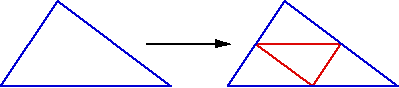

Pour découper un quadrangle, on découpe ses quatre arêtes en deux et on se trouve avec 4 quadrangles non semblables au quadrangle père et donc de qualité différente.

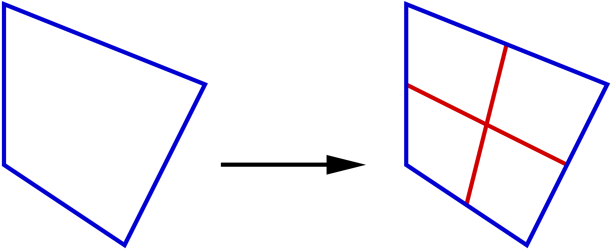

Le découpage des tétraèdres se fait en huit. Pour commencer, chacune des faces triangulaires est découpée en 4 faces triangulaires semblables.

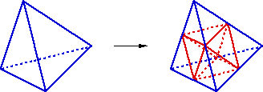

Ce découpage des faces produit 4 tétraèdres dans les angles du tétraèdre initial. On remarque que ces 4 nouveaux tétraèdres sont homothétiques de l'initial. Ils conservent donc la même qualité.

.. image:: ../images/dec_tetr_2.gif
   :align: center
   :alt: Découpage standard d'un tétraèdre - 2
   :width: 201
   :height: 159

Il reste au coeur du tétraèdre, un bloc qui a la forme de deux pyramides accolées par leur base. On crée une arête avec l'une des 3 diagonales possibles, puis les 4 faces qui contiennent cette arête et deux arêtes extérieures.

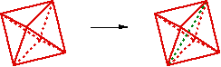

Cela produit 4 nouveaux tétraèdres. On notera qu'ils sont semblables deux à deux, mais qu'ils ne peuvent jamais être semblables au tétraèdre initial. Ils ne pourront donc jamais avoir la même qualité que lui. Toutefois, selon le choix
de la diagonale qui a servi à la découpe du bloc pyramidal interne, le résultat
n'est pas le même. On montre que le meilleur choix, en terme de qualité, est celui
de la plus petite des trois diagonales possibles.

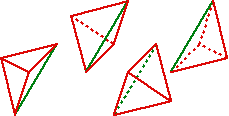

Le découpage des hexaèdres se fait en huit. Chacune des faces quadrangulaires est découpée en 4 faces quadrangulaires. 3 faces internes à l'hexaèdre sont créées, puis chacune est découpée en 4. Cette construction crée 6 points supplémentaires au centre de chaque face externe et un point supplémentaire à l'intérieur de l'hexaèdre.

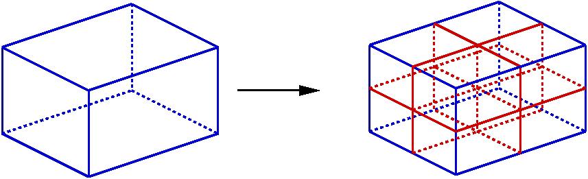

Le découpage des pentaèdres se fait en huit. Chacune des faces quadrangulaires est découpée en 4 faces quadrangulaires de manière standard, de même pour les faces triangulaires. On construit trois arêtes internes chacune parallèle à une des faces quadrangulaires au milieu du penatèdre. On construit ensuite 4 faces triangulaires s'appuyant sur ces arêtes et correspondant au découpage standard d'une face triangulaire à l'intérieur du pentaèdre. Six faces quadrangulaires internes sont créées deux à deux parallèles à chaque face quadrangulaire du pentaèdre.

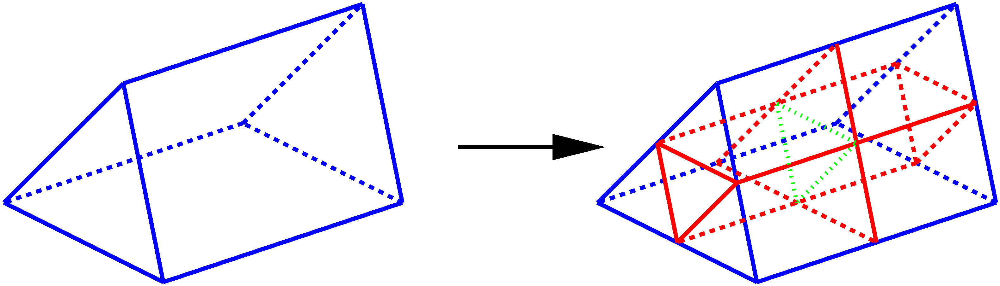

Le découpage de mise en conformité
==================================

Le découpage de mise en conformité s'appliquent aux mailles à l'interface entre deux niveaux de raffinement différent.
Ces découpages produisent des mailles de qualité moindre par rapport aux mailles et on voit dans l'algorithme général comment cet inconvénient est pris en compte pour en minimiser les conséquences.

Etant donné notre algorithme de maillage adaptatif, seules les quatre situations suivantes peuvent être rencontrées :

Dans le cas d'un triangle, l'une de ses trois arêtes est coupée en deux. On joint son milieu au sommet opposé pour former deux nouveaux triangles.

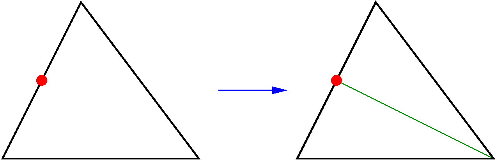

Dans le cas d'un quadrangle, trois cas de figure sont possibles. Dans le premier cas, l'une de ses quatre arêtes est coupée en deux. On joint son milieu aux deux sommets opposés pour former trois triangles. Le maillage adapté obtenu est donc mixte : il comportera des triangles en plus des quadrangles de départ.

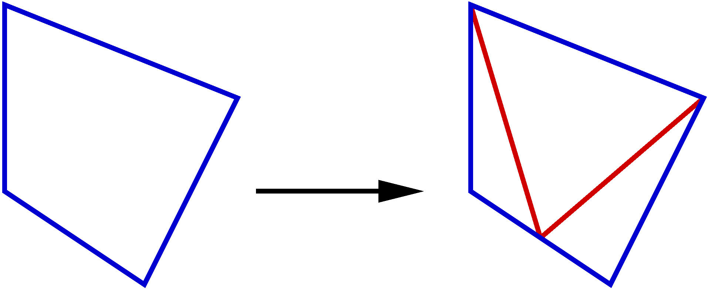

Pour un quadrangle où deux arêtes opposées sont coupées en deux, les deux milieux d'arêtes opposées sont reliés. Il y a création de deux quadrangles.

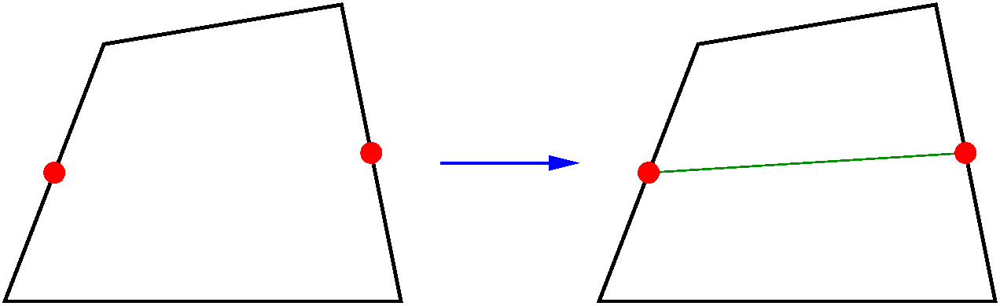

Pour un quadrangle où deux arêtes adjacentes sont coupées en deux, on crée un nouveau noeud au milieu du quadrangle. Ce noeud milieu est relié aux deux milieux des arêtes coupées et au sommet opposé. Il y a création de trois quadrangles.

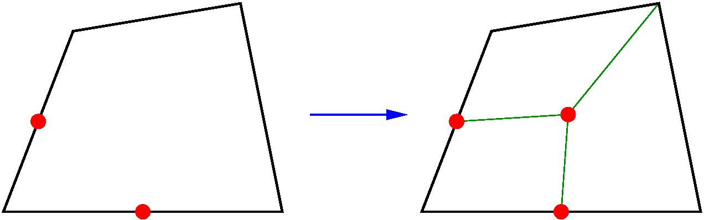

Pour un tétraèdre dont trois des arêtes sont coupées : cela n'est possible que si ces arêtes sont sur la même face. Cette face est donc coupée en quatre. On joint les milieux des arêtes découpées au sommet opposé. Cela coupe en deux les trois autres faces et il y a création de 4 tétraèdres.

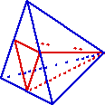

Pour un tétraèdre dont deux des arêtes sont coupées : cela n'est possible que si ces arêtes sont opposées. On fait toutes les jonctions entre les milieux de ces arêtes et les autres sommets, ainsi que entre les deux milieux d'arêtes. Les quatre faces sont coupées en deux et il y a création de 4 tétraèdres.

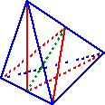

Pour un tétraèdre dont une des arêtes est coupée : on joint le milieu de cette arête découpée au sommet opposé et il y a création de 2 tétraèdres.

.. image:: ../images/dec_tetr_7.gif
   :align: center
   :alt: Découpage de conformité d'un tétraèdre - 3
   :width: 116
   :height: 116

La conformité des hexaèdres est assurée par des combinaisons de tétraèdres et de pyramides. Les situations dépendent du nombre de non-conformités, en respectant les règles de découpage des quadrangles. Voici quelques exemples pris parmi les 66 configurations possibles.

Pour un hexaèdre dont une face est coupée il y a création de 4 arêtes, de 4 tétraèdres et de 5 pyramides.

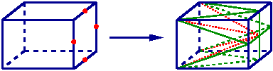

Pour un hexaèdre dont une seule arête est coupée il y a création de deux arêtes et de 4 pyramides.

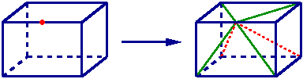

Pour un hexaèdre dont deux arêtes sont coupées il y a création  d'un point central, de 10 arêtes, de 12 tétraèdres et de 2 pyramides.

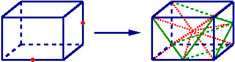

Pour un hexaèdre dont trois arêtes sont coupées il y a création  d'un point central, de 11 arêtes et de 18 tétraèdres.

.. image:: ../images/hexa3aretes.png
   :align: center
   :alt: Découpage de conformité d'un hexaèdre - 3 arêtes
   :width: 384
   :height: 101

L'algorithme
************
.. index:: single: algorithme

La stratégie retenue dans les algorithmes d'HOMARD consiste à forcer le découpage en quatre pour toutes les faces triangulaires ou quadrangulaires présentant deux points de non conformité. A la fin, les seuls triangles ou quadrangles présentant des points de non conformité sont des faces où une arête et une seule est découpée. La mise en conformité est
alors assurée par la solution la plus simple possible comme vu ci-avant.
Cette dernière étape de mise en conformité introduit des mailles dont la qualité peut être plus faible que celle
des mailles dont elles sont issues. Cet inconvénient est contrôlé car nous avons choisi de donner un statut temporaire
à ces mailles de mise en conformité : elles sont présentes pour produire un maillage acceptable par les logiciels
de calcul, mais disparaissent s'il y a besoin de les découper ultérieurement.
Ainsi, la modification de qualité ne se propage pas au fil des itérations d'adaptation de maillage et reste limitée autant en valeur qu'en nombre de mailles concernées.

L'algorithme général est donc le suivant :

    * Transfert des indications de raffinement ou de déraffinement des mailles en décisions de découpage ou de regroupement d'arêtes, de triangles et de quadrangles.
    * Suppression des mailles temporaires de mise en conformité.
    * Par examen de tous les triangles et quadrangles du niveau de découpage le plus bas vers le niveau le plus haut, règlement des conflits sur le déraffinement au moyen des règles de base.
    * Par examen de tous les triangles et quadrangles du niveau de découpage le plus haut vers le niveau le plus bas, règlement des conflits sur le raffinement au moyen des règles de base.
    * Création effective du nouveau maillage : découpage standard, suivi de mise en conformité.

Quelques illustrations de maillage adaptés
******************************************
.. index:: single: illustration

On pourra trouver des exemples d'utilisations de l'adaptation de maillage sur le site de `HOMARD <http://www.code-aster.org/outils/homard/fr/applications.html>`_.

+---------------------------------------------------------------+
+---------------------------------------------------------------+
|                                                               |
| .. image:: ../images/intro_3.png                              |
|    :align: center                                             |
|                                                               |
+---------------------------------------------------------------+
|                                                               |
| .. image:: ../images/intro_4.png                              |
|    :align: center                                             |
|                                                               |
+---------------------------------------------------------------+
|                                                               |
| .. image:: ../images/intro_5.png                              |
|    :align: center                                             |
|                                                               |
+---------------------------------------------------------------+
|                                                               |
| .. image:: ../images/intro_6.png                              |
|    :align: center                                             |
|                                                               |
+---------------------------------------------------------------+
|                                                               |
| .. image:: ../images/intro_7.png                              |
|    :align: center                                             |
|                                                               |
+---------------------------------------------------------------+
|                                                               |
| .. image:: ../images/intro_8.gif                              |
|    :align: center                                             |
|                                                               |
+---------------------------------------------------------------+

