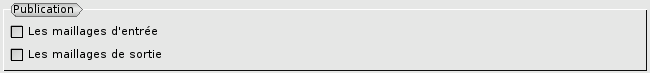

.. _preferences:

Les préférences
###############
.. index:: single: préférences

Un certain nombre de choix par défaut pour le module HOMARD sont définis dans les préférences.

La langue
*********
La langue choisie dans les préférences générales de SALOME est celle qui est utilisée dans les menus de l'interface graphique.

Si le français est retenu, les messages émis par HOMARD le sont en français. Dans tous les autres cas, ils sont en anglais.

Publication des maillages
*************************
.. index:: single: publication

Par défaut, les maillages lus à la création d'un cas ou produits après une adaptation ne sont pas publiés dans SMESH. Ce choix est modifiable en cochant cette préférence.

