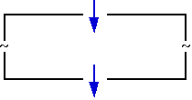
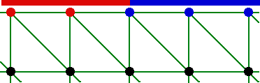
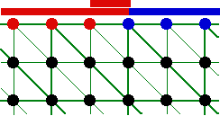
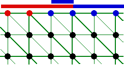
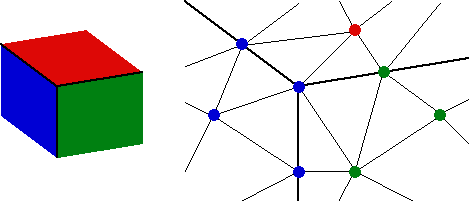
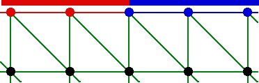
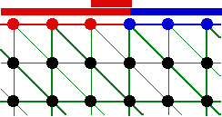

.. _regles:

Règles
######

Quel que soit le mode d'utilisation retenu, des règles générales sont à suivre dans la constitution des données. Elles sont détaillées ici.

Le maillage initial
*******************
.. index:: single: maillage;initial

Le maillage comporte des noeuds, des mailles-points, des segments, des triangles, des quadrangles, des tétraèdres, des hexaèdres et/ou des pentaèdres. Il peut être de degré 1 ou 2. Il peut être en plusieurs morceaux, non connexe.
On peut tout à fait traiter des maillages qui mêlent des zones maillées en volume, et des zones maillées en surfaces. Ces zones peuvent être adjacentes ou non.
Au cours du processus de raffinement, il n'y a pas de régularisation du maillage. Il faut donc veiller à ce que le maillage initial soit le plus régulier possible. Un mauvais maillage initial produira de mauvais maillages découpés. En revanche, ce maillage initial peut être grossier. Il suffit qu'il respecte a minima les conditions initiales.
Enfin, il est souhaitable de posséder dès le départ une bonne représentation des frontières courbes. Le découpage des mailles de bord se faisant sur l'approximation de la frontière par le maillage initial, il n'y aura pas toujours un suivi très fin de courbes accentuées. Néanmoins, pour remédier à cela, un module spécifique de suivi de frontières 1D ou 2D est disponible.

Les conditions aux limites et les sources
*****************************************
.. index:: single: conditions aux limites

La définition des endroits où s'appliquent des conditions aux limites ou des termes source doit être faite sur des entités de même dimension que le phénomène représenté. En clair, cela signifie qu'un chargement ponctuel sera défini sur un noeud. Dans un calcul 2D, la définition des comportements sur les bords se fera par des caractérisations des segments de bord et non pas par les noeuds de bords. De même en 3D, les comportements sur les parois externes du domaine à modéliser sont établis sur les triangles ou les quadrangles qui constituent ce bord. En procédant ainsi, on est sûr de propager correctement ces définitions au fil des raffinements de maillage.

Il ne faut surtout pas définir les conditions aux limites par les noeuds, sinon il est impossible de représenter correctement les frontières après adaptation. Cela va être démontré sur l'exemple suivant.

On veut modéliser ici un cas de mécanique des fluides pour lequel un écoulement entre puis sort d'une cavité. Le modèle est bidimensionnel et, classiquement, on définit les conditions aux limites par des caractérisation des noeuds. Sur le zoom dessiné ci-dessous, on a les noeuds rouges pour la paroi et les noeuds bleus pour l'entrée, les noeuds noirs étant des noeuds libres.

S'il s'avère que le maillage a besoin de découpage autour de la zone d'entrée, il va y avoir création de nouveaux noeuds. Tout le problème va consister à savoir à quelle catégorie appartient un nouveau noeud situé entre un noeud de paroi ou un noeud d'entrée. Si, comme sur le schéma de gauche, on privilégie la paroi, tout va bien. En revanche si, comme sur le schéma de droite, on privilégie l'entrée, il y a un problème : cela revient à agrandir artificiellement l'entrée ... et donc à fausser le calcul !

|cl_2| Paroi ------------------------------ Entrée |cl_3|

Gérer les priorités entre les informations devient très rapidement impossible : il faudrait établir des conventions uniques pour tous les logiciels de calcul associés à HOMARD et traiter une combinaison importante de possibilités. Qui plus est, en 3D, cette technique de gestion de priorités aboutit à des impasses. Essayez d'imaginer la mise à jour des caractérisations des noeuds issus du découpage des tétraèdres dans l'angle de ce domaine. Très rapidement, il devient impossible de trancher entre le bleu, le rouge ou le vert.

La seule solution viable consiste à définir les conditions aux limites sur les mailles de bord. Pour reprendre notre exemple 2D en mécanique des fluides, on donne les caractéristiques paroi ou entrée aux arêtes de bord. Dans le logiciel de calcul, le programme saura transférer très facilement des arêtes vers les sommets frontaliers.

Si le raffinement du maillage a lieu comme précédemment, les nouvelles arêtes prennent la même caractérisation que celles dont elles sont issues : une arête de paroi découpée donne naissance à deux arêtes de paroi et une arête d'entrée découpée donne naissance à deux arêtes d'entrée. De ce fait, le logiciel de calcul n'a aucune difficulté à établir les bonnes informations sur les noeuds frontaliers.

La stratégie d'adaptation
*************************

On a le choix entre plusieurs types de raffinement et de déraffinement :

    * en filtrant les indications d'erreur par des seuils prédéfinis : toutes les mailles qui portent une erreur supérieure à un seuil haut sont découpées et toutes celles pour lesquelles l'erreur est inférieure à un seuil bas sont déraffinées. Ensuite, d'autres découpages interviennent jusqu'à ce que le maillage soit conforme.
    * en filtrant les indications d'erreur par des seuils dépendant de la répartition de l'erreur : toutes les mailles qui portent une erreur supérieure à un décalage par rapport à la moyenne sont raffinées. Ensuite, d'autres découpages interviennent jusqu'à ce que le maillage soit conforme.
    * en filtrant avec des pourcentages de mailles : on découpe les x% de mailles à la plus forte erreur et on déraffine les y% à la plus faible erreur.
    * en n'utilisant que la fonction de raffinement, avec filtrage par rapport à un seuil haut.
    * inversement, en n'utilisant que la fonction de déraffinement, avec filtrage par rapport à un seuil bas.
    * raffinement uniforme ; on ne tient compte d'aucun indicateur d'erreur et le maillage est découpé intégralement : chaque triangle est découpé en 4, chaque quadrangle est découpé en 4, chaque tétraèdre est découpé en 8, chaque pentaèdre est découpé en 8 et chaque hexaèdre est découpé en 8. Attention, le volume du maillage résultat peut être énorme ...

L'indicateur d'erreur
*********************
.. index:: single: indicateur d'erreur

La plupart du temps, l'indicateur d'erreur est un champ de valeurs réelles définis par maille. C'est un des résultats du logiciel de calcul. La sélection des mailles à découper se fait par comparaison de la valeur de l'indicateur et d'un seuil donné.
Par rapport à ce standard, HOMARD accepte deux extensions : un indicateur d'erreur exprimé par noeud et/ou un indicateur d'erreur sous forme entière. Quand l'indicateur est fourni par noeud, HOMARD attribue à chaque maille la plus grande valeur d'erreur trouvée sur les noeuds de la maille. Quand l'indicateur est sous forme entière, la convention retenue est que 1 correspond à une demande de raffinement, -1 correspond à une demande de déraffinement et 0 correspond à ne rien faire.
On n'est pas obligé de fournir une valeur sur chaque maille : si des mailles ne sont associées à aucune valeur, HOMARD leur attribuera une décision par défaut selon les préférences retenues.

L'interpolation des champs
**************************
.. index:: single: interpolation
.. index:: single: champ

HOMARD sait mettre à jour des champs exprimés sur le maillage. Deux cas de figure sont possibles :

    * Si le champ se présente sous la forme d'un champ aux noeuds, HOMARD produira un nouveau champ aux noeuds avec la méthode suivante. Pour un noeud présent dans les deux maillages, avant et après adaptation, la valeur du champ est gardée telle quelle. Pour un nouveau noeud, la valeur du champ est obtenue en fonction des valeurs sur les noeuds les plus proches par interpolation P1, P2 ou iso-P2 selon le degré du maillage et le choix retenu.
    * Si le champ se présente sous la forme d'un champ constant par maille, HOMARD produira un nouveau champ constant par maille. La méthode dépend du caractère du champ : intensif, comme une masse volumique, ou extensif, comme une masse. Pour une maille présente dans les deux maillages, avant et après adaptation, la valeur du champ est gardée telle quelle. Pour une maille issue d'un découpage, la valeur du champ est celle du champ sur la maille mère pour le cas intensif ; c'est la valeur du champ proportionnelle aux volumes des mailles mère et fille pour le cas extensif. Pour une maille issue d'un regroupement après déraffinement, la valeur du champ est la moyenne des valeurs du champ sur les anciennes mailles filles pour le cas intensif ; c'est la somme des valeurs du champ sur les anciennes mailles filles pour le cas extensif.

Ces techniques de mise à jour sont basées sur des champs scalaires. Si un champ vectoriel est transmis à HOMARD par les fichiers MED, chaque composante sera traitée comme un scalaire indépendant. Ensuite, le nouveau vecteur est reconstruit en rassemblant toutes ses composantes.

