.. _yacs:

YACS
####
.. index:: single: YACS

L'utilisation de schémas YACS va permettre de coupler un calcul et une adaptation comme il est décrit dans :doc:`intro`. Ce couplage peut être répété au sein d'une boucle jusqu'à l'obtention d'un critère de convergence par exemple. Il existe de nombreuses façons de programmer un schéma YACS. La solution proposée ici fonctionne mais on peut très bien faire autrement !

On trouvera ici la description exhaustive d'un schéma YACS.

.. note::
  Le module HOMARD propose une création automatique de schéma YASC à partir d'un cas précédemment créé. Pour la mettre en oeuvre, consulter :doc:`gui_create_yacs`

Présentation générale
*********************

On va décrire ici un schéma s'appliquant à un calcul pour lequel on cherche à stabiliser une valeur. Le calcul démarre sur un maillage initial puis HOMARD enchaîne avec une adaptation. On refait un calcul sur ce nouveau maillage et son résultat est analysé. En fonction de cette analyse, le couplage continue ou non. L'allure générale du schéma est la suivante :

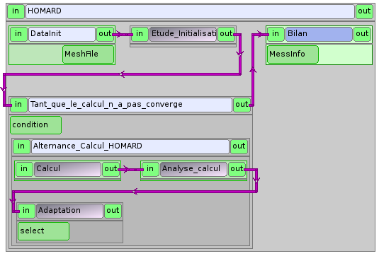

.. note::
  Parmi l'ensemble des données manipulées, certaines sont immuables : le nom du répertoire de calcul, le nom du cas, le nom de l'hypothèse d'adaptation, etc. Il a été choisi de les imposer 'en dur' dans les différents paramètres de service ou au sein des scripts python. On pourrait également les définir a priori dans un noeud PresetNode et ensuite les transmettre par des liens. Nous n'avons pas retenu cette solution car elle augmente fortement le nombre de paramètres et de liens attachés à chaque noeud. Cela est très pénalisant pour la lisibilité du schéma. Les seules données qui vont circuler sont celles imposées par la description du service et celles qui évoluent au cours de l'exécution du schéma.

Les boîtes
**********

Les boîtes principales sont :

- DataInit : initialisation du maillage initial
- Etude_Initialisation : lancement du module HOMARD dans SALOME
- Boucle_de_convergence : gestion de la boucle d'alternance calcul/adaptation
- Bilan : affichage final

DataInit
========
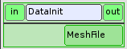

Cette boîte est un noeud élémentaire de type PresetNode. Sa seule fonction est d'initialiser la variable MeshFile qui contient le nom du fichier du maillage initial.

.. literalinclude:: ../files/yacs_01.fr.xml
   :lines: 38-42

Etude_Initialisation
====================
La boîte Etude_Initialisation lance le composant HOMARD dans SALOME. C'est un bloc composé de deux parties, qui sont invariables quelle que soit l'application envisagée :

- StudyCreation : noeud python
- SetCurrentStudy : service du composant HOMARD

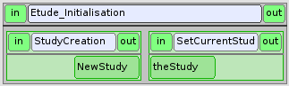

Le noeud python StudyCreation sert à initialiser l'étude SALOME qui est fournie en sortie :

.. literalinclude:: ../files/yacs_01.fr.xml
   :lines: 44-62

Le service SetCurrentStudy affecte cette étude à une instance de HOMARD.

.. literalinclude:: ../files/yacs_01.fr.xml
   :lines: 63-68

Boucle_de_convergence
=====================
La boîte Boucle_de_convergence est une boucle de type WhileLoop. La condition est initialisée à 1 : le bloc interne Alternance_Calcul_HOMARD est exécuté. Au sein de ce bloc, on calcule et on adapte le maillage ; quand le processus doit s'arrêter soit par suite d'erreur, soit par convergence, la condition passe à 0. La boucle s'achève et on passe à la boîte suivante, Bilan.

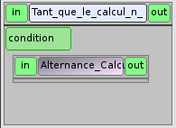

Bilan
=====
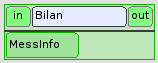

Cette boîte est un noeud python qui prend en entrée une chaîne de caractères, MessInfo. Si tout s'est bien passé, ce message est vide. Une fenêtre QT apparaît pour confirmer la convergence. S'il y a eu un problème, le message contient les messages émis au cours des calculs. La fenêtre QT affiche ce message.

.. literalinclude:: ../files/yacs_01.fr.xml
   :lines: 406-419

La boucle de calculs
********************
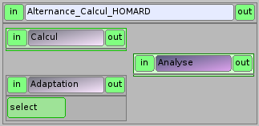

Cette boîte est un bloc qui gère le calcul, l'adaptation et l'analyse.

Calcul
======
.. image:: ../images/yacs_c_03.png
   :align: center
   :alt: Calcul
   :width: 155
   :height: 87

Cette boîte est un noeud python qui va piloter le calcul. En entrée, on trouve le numéro du calcul (0 au départ) et le nom du fichier qui contient le maillage sur lequel calculer. En sortie, on trouve un entier qui représente l'erreur sur ce calcul (0 si tout va bien) et un dictionnaire python rassemblant les résultats du calcul. Le corps du noeud est constitué par le lancement d'un script python qui active le calcul.

.. literalinclude:: ../files/yacs_01.fr.xml
   :lines: 77-103

Dans cet exemple, il faut définir :

- rep_calc : le répertoire dans lequel sera exécuté le calcul.
- rep_script : le répertoire dans lequel se trouve le python qui lancera le calcul. Ce répertoire est à ajouter au PATH. Depuis ce répertoire, on importera 'Script' depuis le fichier ScriptAster.py

Le python Script est programmé comme l'utilisateur le souhaite pour que le calcul puisse être effectué sur le maillage courant. Selon le mode de lancement du code de calcul, on peut avoir besoin d'autres informations, comme le numéro du calcul ou le répertoire du calcul par exemple. La liberté est totale. Dans notre cas, les arguments d'entrée sont le nom du fichier de maillage, le numéro du calcul et le répertoire de calcul sous la forme de la liste python ["--rep_calc=rep_calc", "--num=numCalc", "--mesh_file=MeshFile"]
].

En revanche la sortie du script doit obéir à la règle suivante. On récupère un code d'erreur, un message d'erreur et un dictionnaire. Ce dictionnaire contient obligatoirement les clés suivantes :

- "FileName" : le nom du fichier qui contient les résultats du calcul
- "V_TEST" : la valeur dont on veut tester la convergence

Adaptation
==========
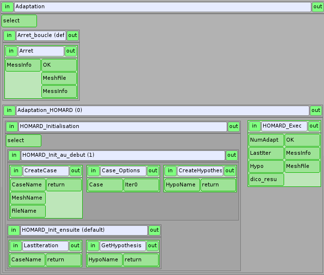

La boîte Adaptation est un noeud Switch piloté par le code d'erreur du calcul précédent. Si ce code est nul, YACS activera la boîte Adaptation_HOMARD qui lancera l'adaptation. Si le code n'est pas nul, on passe directement dans la boîte Arret_boucle.

Adaptation_HOMARD
-----------------
La première tâche à exécuter concerne l'initialisation des données nécessaires à HOMARD dans la boîte HOMARD_Initialisation. Cette boîte est un noeud switch piloté par le numéro du calcul. Au démarrage, le numéro est nul et YACS active la boîte Iter_1.

Iter_1
^^^^^^
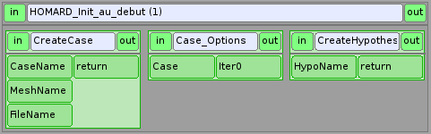

Cette boîte commence par créer le cas HOMARD en appelant le service CreateCase.

.. literalinclude:: ../files/yacs_01.fr.xml
   :lines: 208-215

Le nom du cas CaseName est imposé à "Calcul". Le paramètre d'entrée MeshName est imposé à "BOX". Le paramètre d'entrée FileName est issu de la sortie du calcul précédent. Le paramètre de sortie est une instance de cas.

.. literalinclude:: ../files/yacs_01.fr.xml
   :lines: 443-446

.. literalinclude:: ../files/yacs_01.fr.xml
   :lines: 483-486

Les options de ce cas doivent maintenant être renseignées. C'est fait par le noeud python CaseOptions. Il est impératif de renseigner le répertoire de calcul. On regardera la description des fonctions dans :doc:`tui_create_case`. En sortie, on récupère l'instance de l'itération correspondant à l'état initial du cas.

.. literalinclude:: ../files/yacs_01.fr.xml
   :lines: 216-228

Enfin, une hypothèse est créée en appelant le service CreateHypothese. Le paramètre de sortie est une instance d'hypothèse.

Homard_Exec
^^^^^^^^^^^
Une fois initialisée, l'adaptation peut être calculée. C'est le but de la boîte Homard_Exec, sous forme d'un script python.

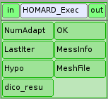

Le répertoire de calcul est récupéré. Le nom du maillage est rappelé.

.. literalinclude:: ../files/yacs_01.fr.xml
   :lines: 245-250

../..

.. literalinclude:: ../files/yacs_01.fr.xml
   :lines: 325-333

L'hypothèse transmise en paramètre d'entrée est caractérisée (voir :doc:`tui_create_hypothese`) :

.. literalinclude:: ../files/yacs_01.fr.xml
   :lines: 254-278

Il faut établir un nom pour la future itération. Pour s'assurer que le nom n'a jamais été utilisé, on met en place un mécanisme de nommage incrémental à partir du nom de l'itération initiale. Comme ce nom initial est le nom du maillage initial, on obtient une succession de noms sous la forme : M_001, M_002, M_003, etc.

.. literalinclude:: ../files/yacs_01.fr.xml
   :lines: 280-290

L'itération est complétée : hypothèse, futur maillage, champ (voir :doc:`tui_create_iteration`) :

.. literalinclude:: ../files/yacs_01.fr.xml
   :lines: 292-311

L'itération est calculée. Si tout s'est bien passé, la variable OK vaut 1 : on pourra continuer l'exécution du schéma. S'il y a eu un problème, la variable OK vaut 0 pour signifier que le calcul doit s'arrêter ; on donne alors un message d'erreur.

.. literalinclude:: ../files/yacs_01.fr.xml
   :lines: 313-324

Après cette exécution, le processus sort du noeud Adaptation_HOMARD, puis du noeud Adaptation. On arrive alors au noeud d'analyse.

Iter_n
^^^^^^
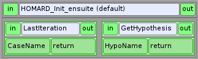

Aux passages suivants dans le bloc d'adaptation, il faut récupérer :

- la dernière itération créée pour la poursuivre : service LastIteration (voir :doc:`tui_create_iteration`)
- l'hypothèse créée : service GetHypothesis (voir :doc:`tui_create_hypothese`)

On passe ensuite dans le noeud Homard_Exec pour calculer le nouveau maillage.

Arret_boucle
------------
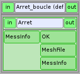

Le bloc Arret_boucle n'est présent que pour faire transiter des variables car les paramètres d'entrée des noeuds doivent toujours être remplis. C'est un python très simple :

.. literalinclude:: ../files/yacs_01.fr.xml
   :lines: 173-184

Analyse
=======
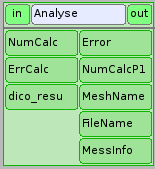

Le bloc Analyse est un script python qui assure le contrôle complet du processus en examinant successivement les causes d'erreur possible.

.. literalinclude:: ../files/yacs_01.fr.xml
   :lines: 104-116

../..

.. literalinclude:: ../files/yacs_01.fr.xml
   :lines: 162-170

On commence par analyser le retour du code de calcul :

.. literalinclude:: ../files/yacs_01.fr.xml
   :lines: 118-123

Vérification de la présence du nom du fichier de résultats dans le dictionnaire des résultats :

.. literalinclude:: ../files/yacs_01.fr.xml
   :lines: 125-132

Vérification de la convergence. Cela suppose que la valeur à tester est présente dans le dictionnaire sous la clé 'V_TEST'. Ici, on a mis en place un test sur la variation de la valeur d'un calcul à l'autre. Au premier passage, on ne teste rien. Aux passages suivants, on teste si la variation relative est inférieure à 1 millième. On aurait pu mettre en place un test absolu si on avait récupéré un niveau global d'erreur par exemple.

.. literalinclude:: ../files/yacs_01.fr.xml
   :lines: 134-152

Enfin, on vérifie que l'on ne dépasse pas un nombre maximal d'adaptations :

.. literalinclude:: ../files/yacs_01.fr.xml
   :lines: 154-159

Utiliser ce schéma
******************
Pour reproduire cet exemple, on pourra télécharger :
  * :download:`le schéma <../files/yacs_01.fr.xml>`
  * :download:`un exemple de script python <../files/yacs_script.py>`
  * :download:`un exemple de script python qui ne fait rien <../files/yacs_script_test.py>`

Il faut l'adapter à la simulation envisagée. En particulier, il faut :

- ajuster les noms des fichiers et des répertoires
- fournir un script de lancement du calcul respectant les consignes évoquées ci-avant
- choisir les hypothèses de pilotage de l'adaptation
- mettre en place le test d'arrêt

