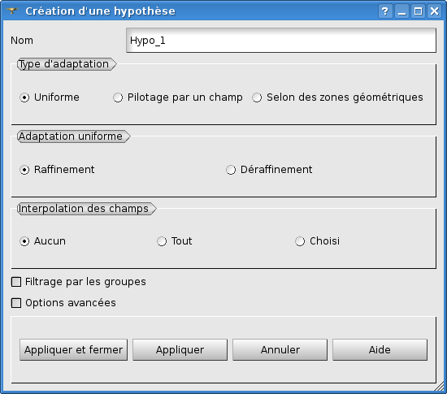
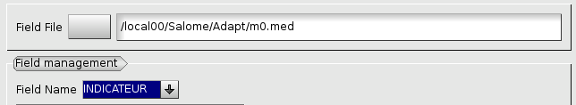
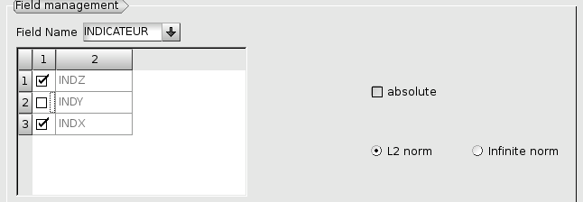
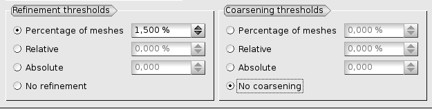
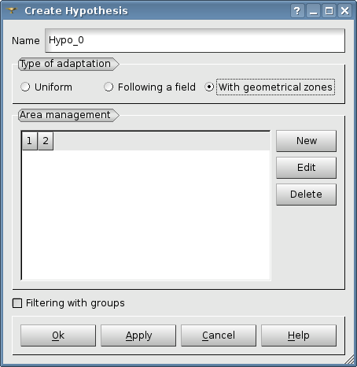
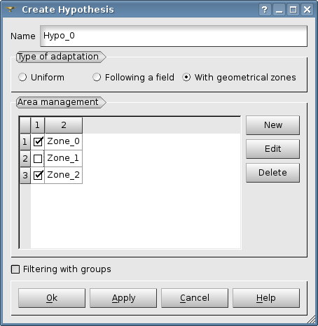
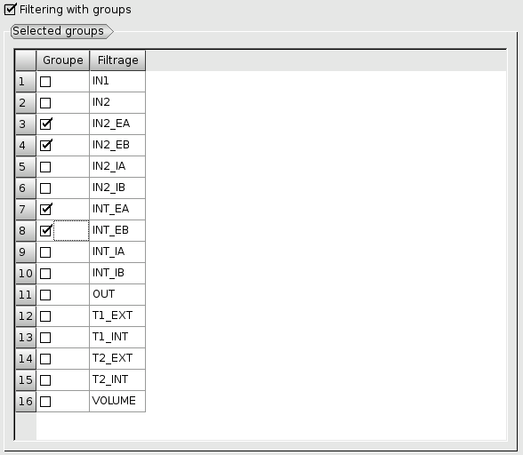
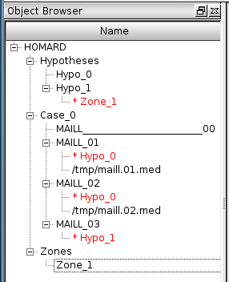

.. _gui_create_hypothese:

L'hypothèse
===========
.. index:: single: hypothèse

L'hypothèse contient toutes les paramètres de pilotage d'une adaptation d'un maillage. Cette opération permet de réaliser l'itération à laquelle elle est attachée. 

Il existe trois classes d'hypothèses :

  - Uniforme sur tout le maillage,
  - Selon un champ,
  - En fonction de zone géométrique. 

Nom de l'hypothèse
""""""""""""""""""
Un nom de l'hypothèse est proposé automatiquement : Hypo_0, Hypo_1, etc. Ce nom peut être modifié. Il ne doit pas avoir été utilisé pour une hypothèse précédente.

Adaptation uniforme
"""""""""""""""""""
Par défaut on propose un raffinement uniforme. Quand on part d'un maillage qui a déjà été raffiné, l'option de déraffinement supprimera les mailles produites.

Adaptation selon un champ
"""""""""""""""""""""""""

.. note::
  Pour pouvoir adapter le maillage selon un champ il faut avoir au préalable indiqué dans la fenêtre de construction de l'itération le fichier med contenant le champ.

Le nom du fichier qui a été sélectionné est affiché sans modification possible dans cette fenêtre. Le champ voulu est à choisir dans la liste qui s'affiche. 

Une fois ce champ choisi, la liste des ses composantes s'affiche. Il suffit de désigner la (ou les) composantes désirées. Si l'on choisi une seule composante, par défaut, c'est sa valeur absolue qui sera utilisée, mais il est possible d'utiliser la valeur relative. Dans le cas de plusieurs composantes, par défaut HOMARD utilisera la norme L2 (euclidienne). On peut toutefois choisir d'utiliser la norme infinie (le max des valeurs absolues des composantes).

Le raffinement se fait selon un seuil qui définit un critère haut de raffinement. Toutes les mailles pour lesquels l’indicateur est supérieur à ce critère seront raffinées.
Pour le choix du critère, trois variantes sont possibles :

  - selon un pourcentage de mailles à raffiner, nombre réel compris entre 0 et 100 ; HOMARD raffinera les x% des mailles qui ont la plus grande valeur du champ.
  - selon une valeur relative du champ, nombre compris entre 0 et 100 ; HOMARD raffinera les mailles où le champ est supérieur à x% de l'intervalle [mini,maxi].
  - selon une valeur absolue ; toutes les mailles avec une valeur de champ supérieure à cette valeur seront raffinées.

La même convention s'applique au déraffinement, en remplaçant supérieur par inférieur. On peut inactiver une des fonctions (raffinement ou déraffinement) en cochant le bouton ad_hoc.

Adaptation selon une zone
"""""""""""""""""""""""""
.. index:: single: zone

Au démarrage, il faut créer une première zone par activation du bouton 'New' (voir :ref:`gui_create_zone`) :

Lorsque des zones ont déjà été créées, la liste apparaît dans la fenêtre ce qui permet de sélectionner les zones voulues. 

Filtrage par les groupes
""""""""""""""""""""""""
.. index:: single: zone

Après l'activation du filtrage par les groupes, la liste des groupes de mailles présents dans le maillage est affichée. Il suffit de cocher ceux voulus pour restreindre l'hypothèse d'adaptation.

L'arbre d'étude
"""""""""""""""
.. index:: single: arbre d'étude

L'arbre d'études contient les hypothèses créées et les itérations qui les utilisent. La description des zones qui leur sont éventuellement attachées est présente.

