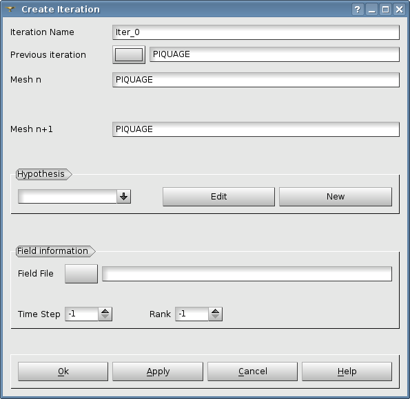
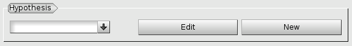
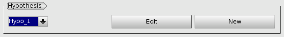
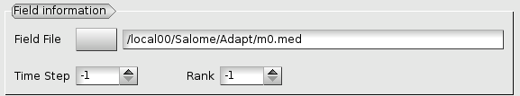
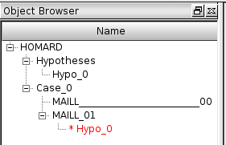

.. _gui_create_iteration:

L'itération
===========
.. index:: single: itération
La définition d'une itération se fait par la donnée des informations suivantes :

  - L'itération précédente
  - Le nom du maillage résultat
  - L'hypothèse utilisée
  - Eventuellement, le fichier du champ d'indicateurs d'erreur

Le nom de l'itération
"""""""""""""""""""""
Un nom de cas est proposé automatiquement : Iter_0, Iter_1, etc. Ce nom peut être modifié. Il ne doit pas avoir été utilisé pour une itération précédente.

L'itération précédente
""""""""""""""""""""""
L'itération précédente est choisie dans l'arbre d'étude. Le nom du maillage correspondant sera affiché.

.. index:: single: maillage;résultat
Le nom du maillage résultat
"""""""""""""""""""""""""""
L'itération en cours de création produira un maillage. Ce maillage sera connu sous un nom. Ce nom est fourni en le tapant dans la zone de texte. Par défaut, on propose un nom identique à celui de l'itération précédente.

.. index:: single: hypothèse
L'hypothèse utilisée
""""""""""""""""""""
L'itération en cours pilotera l'adaptation par HOMARD selon un scénario défini dans une hypothèse. Celle-ci est choisi dans la liste

Au démarrage, il faut créer une première hypothèse par activation du bouton 'New' (voir :ref:`gui_create_hypothese`) :

Ensuite, il faut éventuellement créer une nouvelle hypothèse par activation du bouton 'New', puis sélectionner celle voulue dans la liste proposée :

.. note::
  Si on envisage une adaptation selon les valeurs d'un champ sur le maillage, il faut avoir renseigné les informations sur ce champ avant de créer une nouvelle hypothèse.

.. index:: single: champ
.. index:: single: MED
Le champ
""""""""
Pour créer ou utiliser une hypothèse d'adaptation basée sur un champ exprimé sur le maillage, on doit fournir le fichier où se trouve le champ. Ce fichier est au format MED. Classiquement, il aura été produit par le logiciel de calcul avec lequel on travaille. Le nom du fichier peut être fourni, soit en tapant le nom dans la zone de texte, soit en activant la fonction de recherche.

Les valeurs de 'Time Step' et de 'Rank' sont celles correspondant à la convention MED.

.. index:: single: arbre d'étude
L'arbre d'étude
"""""""""""""""
A l'issue de cette création d'itération, l'arbre d'études a été enrichi. On y trouve l'itération initiale, identifiée par le nom du maillage qui a été lu dans le fichier fourni, l'itération courante, identifiée par son nom. On trouve aussi l'hypothèse qui lui est attachée.

Quand plusieurs itérations s'enchaînent, leur hypothèse est visible dans l'arbre d'étude. On remarquera dans la figure ci-après que deux itérations peuvent partager la même hypothèse.

.. image:: images/create_iteration_6.png
   :align: center

