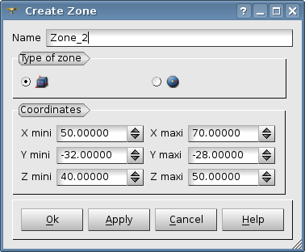
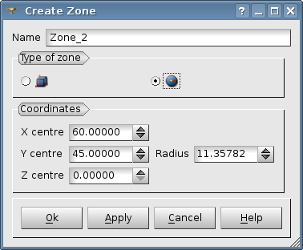

.. _gui_create_zone:

La zone
=======
.. index:: single: zone

L'objet zone contient toutes les définitions géométriques permettant de décrire une zone à raffiner. 

Il existe deux types de zone :

  - Parallélépipède
  - Sphère

Nom de la zone
""""""""""""""
Un nom de zone est proposé automatiquement : Zone_0, Zone_1, etc. Ce nom peut être modifié. Il ne doit pas avoir été utilisé pour une zone précédente.

Un parallélépipède
""""""""""""""""""
.. index:: single: boite

Le parallélépipède est forcément parallèle aux axes de coordonnées, il est défini par ses extrêmes dans chaque direction.

Une sphère
""""""""""
.. index:: single: sphere

La sphère est définie par son centre et son rayon.

.. note::
  Les valeurs proposées par défaut tiennent compte de la géométrie du maillage. 

