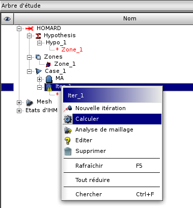

Mode d'emploi pour l'interface graphique
========================================
.. index:: single: cas
.. index:: single: itération

Activer le module HOMARD
""""""""""""""""""""""""
Pour utiliser le module HOMARD, deux façons existent :

#. en activant l'onglet HOMARD dans la liste des modules,
#. en cliquant sur le bouton HOMARD dans la barre d'outils.

L'utilisateur a alors le choix entre créer une nouvelle étude ou en ouvrir une qui a été précédemment enregistrée.

Définir une adaptation
""""""""""""""""""""""

Une fois que HOMARD a été activé, la permière action consiste à créer un cas. Il s'agit de sélectionner le maillage initial de la suite d'adaptations envisagée (voir :ref:`gui_create_case`). A partir de ce cas, on définira les itérations successives (voir :ref:`gui_create_iteration`) à partir des hypothèses (voir :ref:`gui_create_hypothese`).

Récupérer le résultat d'une adaptation
""""""""""""""""""""""""""""""""""""""
Le résultat d'une adaptation s'obtient en sélectionnant l'itération à calculer. On sélectionne ensuite *Lancement* dans le menu HOMARD.

Le fichier contenant le maillage produit est visible dans l'arbre d'études.

Mode d'emploi de la saisie des données
""""""""""""""""""""""""""""""""""""""

.. toctree::
   :maxdepth: 2

   gui_create_case
   gui_create_iteration
   gui_create_hypothese
   gui_create_zone

