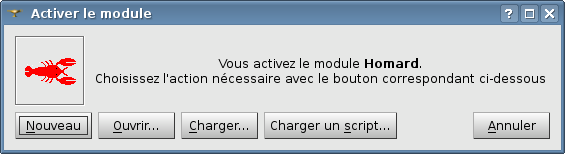
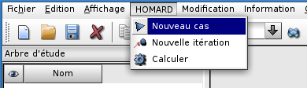
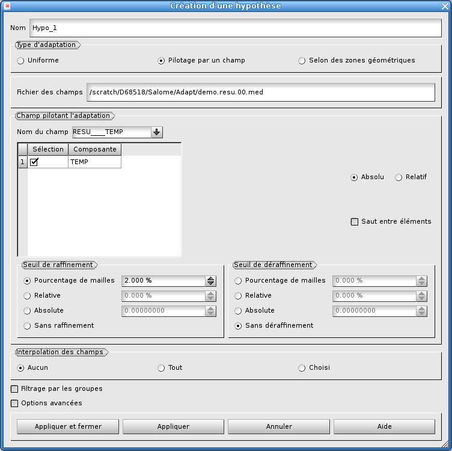
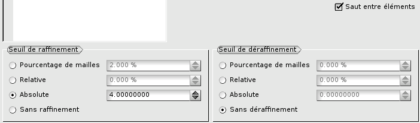
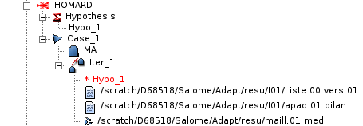

.. _gui_intro:

Introduction
============

Présentation générale
"""""""""""""""""""""
Le logiciel HOMARD est destiné à adapter les maillages dans le cadre des codes de calculs par éléments ou volumes finis. Ce logiciel, réalisé par EDF R&D, procède par raffinement et déraffinement des maillages bidimensionnels ou tridimensionnels. Il est conçu pour être utilisé indépendamment du code de calcul auquel il est couplé.

Raffiner le maillage signifie découper des mailles désignées selon des indications founies par l'utilisateur. Déraffiner le maillage signifie revenir en arrière sur des découpages précédemment réalisés : ainsi, en aucun cas HOMARD ne peut simplifier un maillage existant qui aura été créé trop fin. Le déraffinement prend toute son importance dans les calculs quand la zone d'intérêt se déplace au cours du calcul pour ne plus tenir compte de raffinements précédemment réalisés et qui deviennent inutiles. On en trouvera une illustration au bas de cette page.

HOMARD sait traiter des maillages en 2 ou 3 dimensions et comportant les mailles suivantes :
   - mailles-points
   - segments
   - triangles
   - quadrangles
   - tétraèdres
   - hexaèdres
   - prismes

Ces mailles peuvent être présentes simultanément. Par exemple, HOMARD saura adapter un maillage comportant des triangles et des quadrangles.
Les noeuds acceptés sont évidemment les noeuds qui sont les sommets des mailles, ce qui correspond à la description classique « en degré 1 » . Si les éléments sont décrits « en degré 2 », les noeuds complémentaires sont gérés. En revanche, il ne peut pas y avoir cohabitation de mailles décrites en degré 1 et d'autres décrites en degré 2. Enfin, HOMARD sait prendre en compte des noeuds isolés, qui n'appartiendraient à aucune définition de mailles : ils ressortiront tels quels du processus d'adaptation.

Le cas des pyramides est à part. Pour un maillage comportant des hexaèdres ou des prismes, la mise en conformité du maillage issu du raffinement crée des pyramides pour assurer la liaison entre deux régions de niveaux de raffinement différents. Ces pyramides sont gérées comme toutes les mailles de transition et ne sont pas redécoupées par la suite. En revanche, si le maillage initial contient des pyramides, HOMARD ne saura pas l'adapter et émettra un message d'erreur. Dans certains cas particuliers, on pourra néanmoins traiter un tel maillage, comme il est décrit dans la rubrique 'Options avancées' de :ref:`gui_create_case`).

Plusieurs motivations apparaissent pour adapter un maillage :

  - on veut simplifier la réalisation du maillage d'une géométrie complexe : on part d'un maillage grossier et on confie à un processus automatique la charge de le raffiner.
  - on veut s'assurer de la convergence de la solution numérique : plutôt que de réaliser à la main des maillages de plus en plus fins, on laisse le logiciel chercher lui-même les endroits où il faudrait affiner le maillage pour augmenter la précision du résultat.
  - les conditions du calcul changent au cours de son déroulement : les zones qui doivent être maillées finement se déplacent. Si on maille fin partout dès le début, le maillage est trop gros. En adaptant au fur et à mesure, le maillage ne sera fin qu'aux endroits nécessaires : sa taille sera réduite et la qualité de la solution sera bonne.

Dans tous les cas, le principe de l'adaptation de maillage reste le même. Sur le maillage de départ, on réalise le calcul standard. Avec une analyse de la solution numérique obtenue, on estime l'erreur qui a été commise par rapport à la solution réelle. Cette estimation se représente par une valeur d'indicateur d'erreur dans chaque maille du calcul. A partir de là, on applique le principe suivant : les mailles où l'indicateur d'erreur est fort devraient être plus petites et, réciproquement, les mailles où l'indicateur d'erreur est faible pourraient être plus grandes. Avec cette information, on alimente HOMARD qui va modifier le maillage en conséquence. Sur le nouveau maillage, on recommencera alors le calcul.
Schématiquement, une itération d'adaptation de maillage se présente ainsi. Le logiciel calcule la solution numérique sur le maillage n°k, puis en déduit les valeurs de l'indicateur d'erreur sur tout le maillage. A partir de la connaissance du maillage n°k et de l'indicateur n°k, HOMARD crée le nouveau maillage n°k+1.

.. image:: images/intro_1.png
   :align: center

Au final, la chaîne complète part du maillage initial produit par un mailleur. Elle comprend des maillons successifs (calcul d'indicateur / adaptation) comme sur la figure ci-après.

.. image:: images/intro_2.png
   :align: center

Des variantes de ce schéma de base sont possibles. Si aucun calcul d'erreur n'est disponible dans le logiciel couplé, on peut utiliser un champ pour piloter l'adaptation. Un champ de contraintes en mécaniques peut être utilisé : raffiner là où les contraintes sont importantes est souvent efficace pour améliorer la qualité de la simulation. On peut également adapter en fonction du saut d'une variable d'une maille à sa voisine ou dans une zone connue a priori. Grâce à ses nombreuses options, HOMARD permet d'envisager de multiples scénarios d'adaptation de maillage.

.. note::
  Pour une description plus complète, voir :download:`Description générale de HOMARD <files/HOMARD_0.pdf>`.

.. note::
  Pour une référence à HOMARD, utiliser :
  G. Nicolas and T. Fouquet, Adaptive Mesh Refinement for Conformal Hexahedral Meshes, Finite Elements in Analysis and Design, Vol. 67, pp. 1-12, 2013, doi:10.1016/j.finel.2012.11.008
  `Acessible en cliquant ici <http://dx.doi.org/10.1016/j.finel.2012.11.008>`.

Quelques illustrations de maillage adaptés
""""""""""""""""""""""""""""""""""""""""""
.. index:: single: illustration

+---------------------------------------------------------------+
+---------------------------------------------------------------+
|                                                               |
| .. image:: images/intro_3.png                                 |
|    :align: center                                             |
|                                                               |
+---------------------------------------------------------------+
|                                                               |
| .. image:: images/intro_4.png                                 |
|    :align: center                                             |
|                                                               |
+---------------------------------------------------------------+
|                                                               |
| .. image:: images/intro_5.png                                 |
|    :align: center                                             |
|                                                               |
+---------------------------------------------------------------+
|                                                               |
| .. image:: images/intro_6.png                                 |
|    :align: center                                             |
|                                                               |
+---------------------------------------------------------------+
|                                                               |
| .. image:: images/intro_7.png                                 |
|    :align: center                                             |
|                                                               |
+---------------------------------------------------------------+
|                                                               |
| .. image:: images/intro_8.gif                                 |
|    :align: center                                             |
|                                                               |
+---------------------------------------------------------------+

Démarrage rapide
""""""""""""""""
.. index:: single: démarrage
.. index:: single: exemple

L'ensemble des options de pilotage du module HOMARD dans Salome est décrit dans le :ref:`gui_usage`. Mais on trouvera ici le B.A. BA pour découvrir l'utilisation de HOMARD à partir d'un exemple simple. Imaginons que l'on a effectué un calcul de thermique sur un maillage donné. On a récupéré en sortie de ce calcul un fichier au format MED, contenant le maillage et le champ des températures aux noeuds. On aimerait adapter le maillage de telle sorte que l'écart de température entre deux noeuds voisins soit inférieur à une valeur donnée.

La première action nécessite de lancer le module HOMARD, en créant une nouvelle étude, selon le principe qui a été retenu pour tous les autres modules de Salome.

Une fois le module HOMARD activé, on crée un cas par le choix "*Nouveau cas*" dans le menu HOMARD.

La fenêtre suivante apparaît :

.. image:: images/intro_31.png
   :align: center

Il faut fournir deux informations : le répertoire qui contiendra les fichiers produits par les adaptations successives et le fichier issu du calcul que l'on vient de faire. On valide par "Appliquer et fermer".

.. image:: images/intro_32.png
   :align: center

L'arbre d'études est enrichi de ce cas. On déplie le cas jusqu'à afficher le maillage correspondant à l'itération 0. On désigne cette itération initiale et on demande une nouvelle itération par "*Nouvelle itération*" dans le menu HOMARD ou à la souris.

.. image:: images/intro_331.png
   :align: center

La fenêtre suivante apparaît :

.. image:: images/intro_33.png
   :align: center

On désigne le fichier issu du calcul que l'on vient de faire et qui contient le champ de température. C'est le même que celui qui a été donné dans la définition du cas.

.. image:: images/intro_34.png
   :align: center

On clique sur "Nouveau" dans la rubrique hypothèse. La fenêtre suivante apparaît :

On modifie les options par défaut pour correspondre à notre choix de pilotage de l'adaptation. La sélection d'un pilotage par les saut entre éléments et d'un seuil absolu de 4.0 va demander le découpage de chaque arête de maille où le température varie de plus de 4.0 degrés entre les deux extrémités de l'arête.

On valide par "Appliquer et fermer" cette création d'hypothése, puis la création de la nouvelle itération. On se retrouve avec un arbre d'études enrichi avec la description de l'hypothèse créée et de l'itération à calculer, repérée par une icone "en attente".

Lancer l'adaptation s'obtient en sélectionnant l'itération à calculer. On choisit ensuite "*Calculer*" dans le menu HOMARD ou à la souris. L'arbre d'études s'enrichit de fichiers d'informations et du nom du fichier au format MED qui contient le nouveau maillage, ``maill.01.med``. On remarque qu'il est placé dans le répertoire qui a été désigné à la création du cas.

A ce stade, on va utiliser ce nouveau maillage pour un deuxième calcul, dans les mêmes conditions que le premier. Une fois que ce nouveau calcul est achevé, on peut décider de poursuivre le processus d'adaptation. Pour cela on revient dans Salome et on active le module HOMARD. On désigne l'itération que l'avait calculée précédemment "*Iter_1*" et on demande une nouvelle itération. La fenêtre suivante apparaît :

.. image:: images/intro_38.png
   :align: center

Comme on continue l'adaptation avec le même critère de saut de température entre noeuds voisins, on garde l'hypothèse "*Hypo_1*". Il suffit de désigner le fichier issu du calcul que l'on vient de faire et qui contient le nouveau champ de température.

.. image:: images/intro_39.png
   :align: center

Comme précédemment, on lance l'adaptation et on récupère les résultats dans le répertoire du cas, dont le maillage ``maill.02.med``.

.. image:: images/intro_40.png
   :align: center

On peut alors lancer un nouveau calcul sur ce nouveau maillage et poursuiver cette alternance calcul/adaptation jusqu'à l'obtention du résultat attendu.

Evolutions du module
""""""""""""""""""""
.. index:: single: évolution

On trouvera ici les principales évolutions de HOMARD à partir de la première version livrée dans SALOME 6.5.

SALOME VERSION 6.6 :
   - Interfaçage avec med 3.0.6
   - Valeurs par défaut des instants
   - Acceptation des mailles de type TRIA7 et QUAD9
   - Option de sortie dans le fichier MED du niveau de raffinement atteint dans chaque maille

SALOME VERSION 7.1 :
   - Correction d'une anomalie sur le filtrage du raffinement par les groupes
   - Pilotage de l'adaptation par un seuil basé sur la moyenne et l'écart-type (voir :ref:`tui_create_hypothese`)
   - En TUI, choix du dernier instant comme instant de pilotage par SetTimeStepRankLast (voir :ref:`tui_create_iteration`)
   - Possibilité de détruire les objets (GUI et TUI)
   - Modification des fonctions TUI pour qu'elles agissent sur les objets et non plus sur les noms :
     ``homard.AssociateIterHypo(iter_name,hypo_name)`` devient ``iter.AssociateHypo(hypo_name)``, ``homard.AssociateHypoZone(hypo_name,zone_name,type_use)`` devient ``hypo.AddZone(zone_name,type_use)``, ``homard.CreateIteration(iter_name,iter_parent_name)`` devient ``case.NextIteration(iter_name)`` ou ``iter.NextIteration(iter_name)``
   - Ajout de fonctions :
     ``cas.LastIteration()`` : retourne la dernière itération de la descendance du cas (voir :ref:`tui_create_iteration`)
   - Analyse de maillages (voir :ref:`gui_mesh_info`)

SALOME VERSION 7.2 :
   - Possibilité d'utiliser un cone comme support de frontiere 2D (voir :ref:`tui_create_boundary`)
   - Choix de publier ou non le résultat dans SMESH (voir :ref:`tui_create_iteration`)
     ``iter.Compute(option)`` devient ``iter.Compute(option1, option2)``
   - Possibilité de poursuivre une suite d'itérations archivées dans un répertoire (voir :ref:`gui_create_case`)

